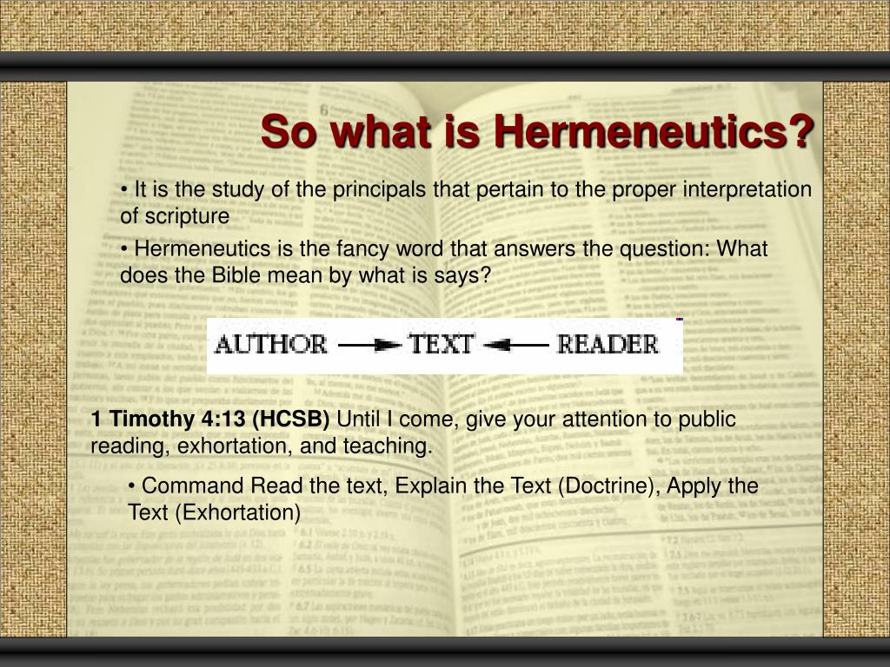

#fundamental/communication

Hermeneutics is a branch of knowledge that focuses on the **interpretation of texts, particularly sacred texts and philosophical works**, but it can also apply to legal texts, literature, and even non-textual forms of expression, such as visual and audio media.

There are several branches and techniques of hermeneutics, including:

1. **Biblical Hermeneutics:** This refers to different Bible interpretations. Different religious groups have various Bible interpretation methods, which can greatly impact their beliefs and practices.
2. **Philosophical Hermeneutics:** This branch focuses on the nature of understanding and interpretation. It was significantly developed by the German philosopher Hans-Georg Gadamer in his work “Truth and Method,” where he argues that our historical and cultural contexts shape our understanding.
3. **Critical Hermeneutics:** This branch stresses the importance of power dynamics, historical context, and societal influence in shaping the interpretation of texts.
4. **Psychoanalytic Hermeneutics:** This form uses concepts from [psychoanalysis](../../003_education/kings%20college/03%20Mental%20Health%20in%20the%20Community/Psychoanalysis.md) to interpret texts, often focusing on unconscious desires or fears.
5. **Legal Hermeneutics:** This is the study of the correct interpretation of legal texts.
