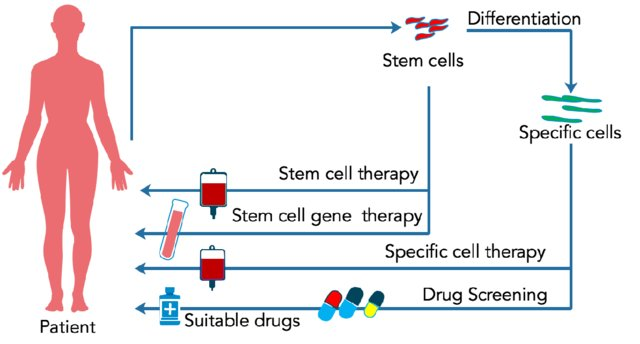

#core/appliedneuroscience 

Personalised regenerative medicine is a medical approach that uses **an individual’s biological material, such as cells or tissues, to repair or replace damaged or diseased tissue.** This approach is based on the idea that using a person’s own cells or tissues can reduce the risk of rejection or adverse effects compared to using foreign substances. Personalised regenerative medicine can be tailored to a patient’s specific needs and may involve stem cells, gene therapy, tissue engineering, or other techniques.

> [!info] Personalised regenerative medicine — key additions
> - Personalisation levers: autologous sourcing, HLA matching, gene correction (e.g., CRISPR), patient-specific biomaterials/scaffolds, dose and delivery route tailoring.
> - Modalities and examples: autologous iPSC-derived cells (e.g., dopaminergic neurons for Parkinson’s), mesenchymal stromal cells, autologous chondrocyte implantation, CAR‑T for haematological cancers, platelet‑rich plasma, engineered tissues (skin, cartilage), peripheral nerve guides; emerging exosome‑based therapies.
> - Typical workflow: harvest → isolate/QC → expand/differentiate → optional gene editing → formulate with scaffold/biomaterial → deliver (surgical/injection) → longitudinal monitoring (biomarkers, imaging).
> - Benefits vs risks: reduced rejection, precise tissue matching, potential disease modification; challenges include manufacturing variability, tumourigenicity, off‑target edits, immunogenicity after culture, time‑to‑treatment, cost, and scale‑out logistics.