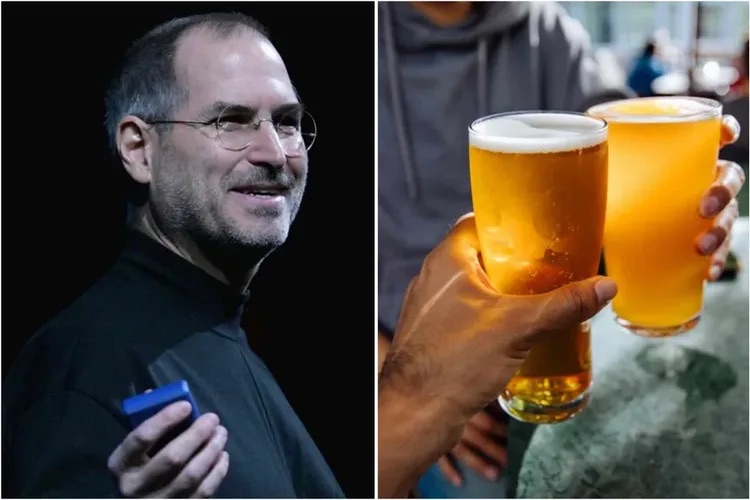

#fundamental/communication #fundamental/creativity

The beer test was a **hiring technique used by [Steve Jobs](https://en.wikipedia.org/wiki/Steve_Jobs) at Apple in which candidates were taken for an informal walk and a beer rather than a conventional boardroom interview.** The goal was to assess whether Jobs would genuinely enjoy spending time with the person outside work — a judgment of cultural compatibility, not technical competence.

> "You want to hire people who you'd want to have a beer with."

## The Principle

Jobs' rationale was simple: brilliant people who are difficult to work with eventually damage the organisation regardless of their output. The beer test filters for _collegiality_ — the candidate's ability to engage in unstructured conversation, react naturally, and reveal personality traits invisible in formal settings. The walk-and-talk format also disarms prepared interview scripts, surfacing how someone thinks in real time.

This is a form of **cultural-hire screening**: technical skill gets you in the door; cultural fit determines whether you stay and thrive.

## Limitations

The beer test is not without critics:

- **Homogeneity risk** — "people I'd have a beer with" tends to select for people like oneself, reinforcing demographic and cognitive monocultures. The most celebrated examples of innovation often come from teams of complementary opposites, not clones.
- **"Culture fit" as bias cover** — the phrase has been weaponised to exclude candidates on grounds of race, class, neurotype, or personality while claiming it was about "fit."
- **Not a substitute for competence** — the beer test was layered on top of rigorous technical evaluation at Apple, not a replacement for it. Used alone it selects for charm over ability.
- **Introvert penalty** — the format inherently favours extroverts comfortable with unstructured socialising; it may filter out deep thinkers who perform poorly in casual small talk.

## Modern Variants

Several organisations have adapted the spirit of the beer test with more structured forms:

- **Amazon's "Bar Raiser"** — a designated interviewer with veto power, trained to assess cultural alignment and raise the hiring bar independent of the hiring manager's urgency to fill a role.
- **Startup culture interviews** — many early-stage companies run a dedicated culture-fit round, often with future peers rather than managers, to assess collaboration style without the informality risks of the original beer test.
- **Work trials and paid projects** — some teams replace conversational culture screening with real collaborative work, observing how a candidate actually operates rather than how they present over a drink.

## Contrast with Nepotism

The beer test and [nepotism](nepotism.md) sit on opposite sides of a fine line: both involve personal judgment in hiring, but the beer test applies personal preference _after_ competence is established, whereas nepotism applies it _instead_ of competence. One is a cultural tiebreaker; the other is an anti-meritocratic shortcut. Conflating the two — hiring friends because you'd have a beer with them — is precisely the pathology the structured variants are designed to prevent.

## Related Concepts

- [Nepotism](nepotism.md) — the failure mode of unchecked personal preference in hiring
