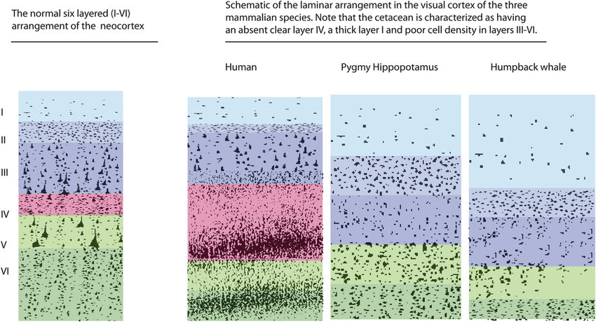

#core/appliedneuroscience

Laminar cytoarchitecture refers to the **specific arrangement of neuronal cell bodies and their organisation into distinct layers within a particular region of the brain**, most notably in the cerebral cortex. This layered structure is crucial for the brain's functional specialisation and efficient processing of information, and forms the basis for classical cytoarchitectonic parcellation of the cortex.

## Key Features

### 1. Cortical Layers

The neocortex is organised into six horizontal layers, each with unique types of neurons and connections. Layer prominence varies considerably across cortical areas, reflecting their specialised functions:

- **Layer I (Molecular / Plexiform Layer)**: Very cell-sparse, lying directly beneath the pia. Contains mainly dendrites and axons from deeper-layer neurons plus a small population of interneurons (including Cajal–Retzius cells in early development). Important for intracortical integration and horizontal interactions across columns.
- **Layer II (External Granular Layer)**: Contains a mixture of small [pyramidal neurons](../../003_education/kings-college/06_neuroimaging_in_mental_health/pyramidal_neurons.md) and small granule (stellate) cells, plus interneurons. Contributes to corticocortical connections, particularly to nearby cortical areas, and participates in local processing within columns.
- **Layer III (External Pyramidal Layer)**: Contains small–medium [pyramidal neurons](../../003_education/kings-college/06_neuroimaging_in_mental_health/pyramidal_neurons.md) plus interneurons. Major source of corticocortical association and callosal (commissural) fibres, projecting to other ipsilateral and contralateral cortical regions. Critical for horizontal integration across cortical areas.
- **Layer IV (Internal Granular Layer)**: Dominated by densely packed small stellate/granule cells. Principal recipient of thalamocortical sensory input, especially prominent in primary sensory (koniocortical) areas where it is thick and well differentiated. Gives rise to short-range projections to supragranular and infragranular layers.
- **Layer V (Internal Pyramidal Layer)**: Contains large [pyramidal neurons](../../003_education/kings-college/06_neuroimaging_in_mental_health/pyramidal_neurons.md), including Betz cells in primary motor cortex. Major source of corticofugal output to subcortical targets: brainstem, spinal cord, and some thalamic and basal ganglia nuclei. Prominent in motor and association areas; less developed in highly granular sensory cortex.
- **Layer VI (Multiform / Fusiform Layer)**: Heterogeneous mix of fusiform and smaller pyramidal cells plus interneurons. Sends dense corticothalamic projections back to thalamic nuclei and also contributes to intracortical and commissural fibres. Gradually transitions into the underlying white matter, acting as an interface between cortex and subcortical structures.

### 2. Functional Specialisation

- Different cortical areas have variations in the prominence of these layers, reflecting their specialised functions. Sensory cortices (e.g. primary visual cortex, V1) are **granular** with a thick, elaborated layer IV for processing sensory input, whereas motor and limbic regions are **dysgranular or agranular**, with a poorly developed or absent layer IV and prominent layers V–VI.
- The motor cortex has a thicker layer V, accommodating large [pyramidal neurons](../../003_education/kings-college/06_neuroimaging_in_mental_health/pyramidal_neurons.md) that project to motor neurons in the spinal cord.
- The six-layer scheme applies to neocortex; allocortical regions (e.g. hippocampus, piriform cortex) have fewer layers and different laminar patterns, also studied under cytoarchitecture.

### 3. Cortical Columns and Minicolumns

Cytoarchitecture is not only laminar but also **columnar**: neurons are organised into vertical cortical columns and minicolumns that span layers II–VI and share similar response properties. Mountcastle's work proposed that these columns are fundamental functional units of the neocortex, with thalamic inputs entering mainly in layer IV and being processed vertically through supragranular and infragranular layers. Laminar cytoarchitecture thus intersects with columnar organisation, where layer-specific cell types and microcircuits implement computations within each column while maintaining parallel, repeated structure across the cortical sheet.

### 4. Brodmann Areas and Cytoarchitectonic Parcellation

Classical [Brodmann areas](https://en.wikipedia.org/wiki/Brodmann_area) were defined by systematic differences in cytoarchitecture: neuronal size, packing density, laminar differentiation (especially layer IV), and myeloarchitecture. Primary sensory cortex (e.g. BA 17, V1) shows striking koniocortical features with a thick granular layer IV and a conspicuous myelinated band visible to the naked eye — the **stria of Gennari**, a greatly thickened outer band of Baillarger formed by thalamocortical fibres terminating in layer IV. By contrast, agranular frontal and limbic areas have weak or absent layer IV and relatively undifferentiated lamination. These cytoarchitectonic differences align with functional specialisation and are increasingly being refined by modern histology, MR microscopy, and transcriptomic cytoarchitecture, which reveal how laminar cell-type composition predicts areal connectivity and computational roles.

### 5. Species Differences: Lissencephalic vs Gyrencephalic Cortex

Cytoarchitecture varies across species, reflecting differences in cortical folding, size, and evolutionary specialisation. Lissencephalic cortices (e.g. mouse) lack extensive [gyri and sulci](gyri_and_sulci.md) yet still exhibit laminar organisation, typically with thinner layers and different relative proportions of supragranular vs infragranular neurons compared with gyrencephalic human cortex. Human association cortex shows more complex laminar differentiation and expanded supragranular layers, supporting rich corticocortical connectivity and higher-order cognition. These cross-species cytoarchitectural differences help explain variation in network topology and are relevant for translational neuroscience, as mouse models may differ from human cortex in the laminar distribution of cell types and projections.

### 6. Hierarchical Cortical Processing

Laminar cytoarchitecture underpins hierarchical cortical processing via layer-specific feedforward and feedback projections. In the visual system, feedforward connections from lower to higher areas typically arise from **supragranular layers (II–III)** and terminate mainly in layer IV of their targets, while feedback projections from higher to lower areas originate preferentially in **infragranular layers (V–VI)** and terminate predominantly in layer I and deep layers (including VI), characteristically sparing layer IV. This pattern, described by Felleman and Van Essen, supports predictive processing schemes where higher areas send predictions via feedback to superficial and deep layers, and lower areas send prediction errors via feedforward pathways through granular and supragranular layers. Thus, laminar specialisation is tightly linked to the directionality of information flow and the implementation of cortical hierarchies.

## Techniques for Studying Laminar Cytoarchitecture

- **Histological Staining**: [Nissl staining](../../003_education/kings-college/01_techniques_in_neuroscience/nissl_staining.md) is commonly used to highlight neuronal cell bodies and distinguish the cortical layers.
- **Immunohistochemistry**: Identifies specific proteins within different layers, providing insights into the functional roles of each layer.
- **Electrophysiology**: Measures electrical activity across layers to understand how information flows through the cortical columns.
- **MR Microscopy and Histology**: High-resolution ex vivo MRI and myelin-sensitive imaging reveal laminar structure in 3D, complementing classical 2D histology.
- **Transcriptomic Cytoarchitecture**: Spatial transcriptomics and single-cell sequencing map laminar cell-type composition, refining classical cytoarchitectonic boundaries defined by Brodmann and others.