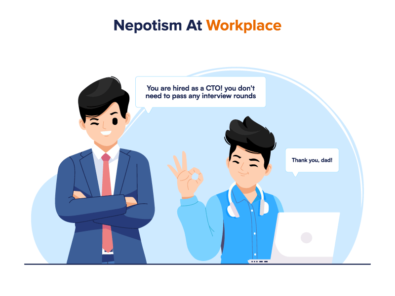

#core/appliedneuroscience

Nepotism is the **practice of favouring one’s relatives or friends**, especially by giving them jobs or other opportunities, regardless of their qualifications or merit. It is a form of discrimination that can lead to unfair advantages for those who are related or connected to those in positions of power.
