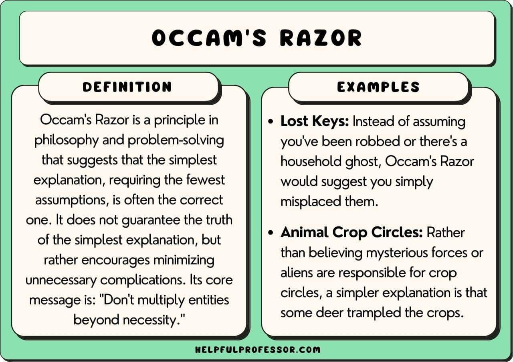

#fundamental/logic

Occam's razor is a **philosophical principle that the simplest explanation — the one requiring the fewest assumptions — is usually preferable.** Named after [William of Ockham](https://en.wikipedia.org/wiki/William_of_Ockham), a 14th-century English Franciscan friar and scholastic philosopher, it is a heuristic for theory selection, not a law of nature.

Its classical Latin formulation — _Entia non sunt multiplicanda praeter necessitatem_ ("Entities must not be multiplied beyond necessity") — was in fact never written by Ockham himself, though it captures the spirit of his thought. Ockham's actual phrasing was closer to: "It is futile to do with more what can be done with fewer."

## Principle

When multiple hypotheses explain the same data equally well, prefer the one with fewer degrees of freedom, fewer causal entities, or fewer ad-hoc assumptions. Simplicity is a tiebreaker, not a truth-guarantee: a simpler explanation can still be wrong.

> [!example] Dead Car
> Your car won't start. Possible causes: dead battery, broken starter, empty fuel tank, seized engine, complex electrical fault. Occam's razor suggests checking the battery first — it requires the fewest assumptions and is the most common cause. If a jump-start works, the simplest explanation was correct.

## Applications

- **Science** — Parsimony is a criterion in theory choice (alongside falsifiability, explanatory scope, and coherence). Ptolemaic epicycles could fit any orbit with enough circles; Kepler's ellipses required far fewer parameters for equal accuracy.
- **Machine learning** — Occam's razor manifests as [inductive bias](../books/_general/inductive_bias.md): regularisation penalises model complexity, and the preference for simpler decision boundaries helps prevent overfitting. The principle that "the simplest model consistent with the data should be preferred" is foundational to generalisation theory.
- **Medicine** — "When you hear hoofbeats, think horses, not zebras": diagnostic reasoning defaults to common explanations before rare ones, an application of base-rate parsimony.
- **Comparative psychology** — [Morgan's Canon](../../003_education/kings-college/02_psychological_foundations/morgans_cannon.md) explicitly applies Occam's razor to animal behaviour: do not attribute higher cognitive processes when simpler mechanisms (associative learning, instinct) suffice.

## Limitations

Occam's razor fails when simplicity and truth diverge:

- **Emergent phenomena** — complex systems can produce behaviour irreducible to simple component-level descriptions. See [emergent properties](../videos/emergent_properties.md) and [strong emergence](../videos/strong_emergence.md) for cases where "the whole is more than the sum of its parts" — the simplest explanation may systematically miss the phenomenon.
- **Quantum mechanics** violates classical intuitions of simplicity, yet is the most accurate physical theory ever tested.
- **Parsimony is methodological, not ontological** — nature has no obligation to be simple. As J.B.S. Haldane reportedly quipped, "The universe is not only queerer than we suppose, but queerer than we _can_ suppose."

Occam's razor is best understood as a **default heuristic**, not an epistemic warrant. It helps prune the search space; it does not certify the survivor.

## Related Concepts

- [Morgan's Canon](../../003_education/kings-college/02_psychological_foundations/morgans_cannon.md) — the parsimony principle applied to animal cognition
- [Inductive bias](../books/_general/inductive_bias.md) — Occam's razor as the most fundamental bias in machine learning
- [Emergent properties](../videos/emergent_properties.md) — when complexity defies parsimonious reduction
- [Strong emergence](../videos/strong_emergence.md) — the philosophical claim that some phenomena genuinely resist simplification
