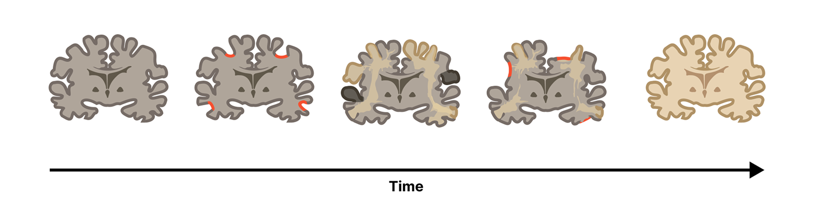
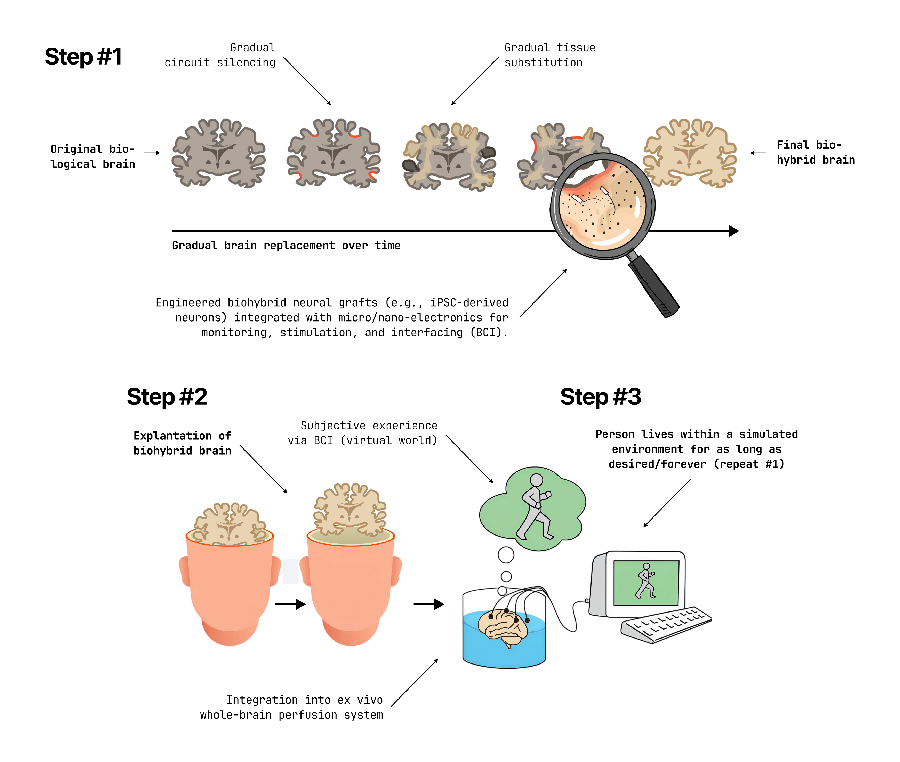

#lead/consciousnessengineering #core/biomimeticneuromorphics #core/appliedneuroscience #core/artificialintelligence

The **Progressive Synthetic Neural Substrate Transfer** (PSNST) is a hypothetical cognitive preservation procedure envisioned by [Daniel Burger](https://danielburger.online/) to seamlessly transfer encoded neural information from a biological to an optimised synthetic biological substrate (or ultimately a fully *de novo synthetic substrate*), ensuring the preservation of cognitive functions and personal identity. This is achieved by leveraging the effect of neuroplasticity and the automatic rearrangement of encoded information when brain tissue is destroyed slowly (cortical reorganisation; such as in normally occurring effects like a low-grade brain tumours). This idea aims to solve the issues arising from classical mind-uploading by avoiding the destruction of a person’s cognitive continuity (i.e. the [teletransport paradox](https://en.wikipedia.org/wiki/Teletransportation_paradox)), and also avoiding other philosophical problems related to mind-uploading and generally with whole-brain emulation—challenges explored in [Philosophical zombies](philosophical_zombies.md) and [Existential altruism](../papers/existential_altruism.md). The approach aligns with [Chalmers' organisational invariance argument](../books/from_biological_to_artificial_consciousness/fading_qualia.md): gradual replacement preserves functional organisation, and therefore qualia. A potential method for the controlled cell death of neuronal cells could be induced by silencing them via genetics or a laser.

In contrast to other work, such as that from the [Hébert Lab](https://hebertlab.einsteinmedneuroscience.org/), the idea behind PSNST is that the new neural substrate is designed for high-throughput brain-computer interfacing (e.g., by genetically modifying the synthetic neural substrate to enable optogenetic interfacing, [bioprinting](../../003_education/kings-college/05_neuroscience_in_society/bioprinting.md) it around electrodes/nanoparticles (neural dust), etc.). The goal is not to keep the person inside the original skull—creating an [ex cranio](../books/sizing_up_consciousness/ex_cranio_brains.md) or [island of awareness](../books/sizing_up_consciousness/island_of_awareness.md) scenario—but rather to enable the explanted brain to be collocated across physical distances for redundancy (akin to globally distributed software on cloud computing) and to facilitate sensory input from simulated environments or robots, rather than a biological physical body. The main vision is to not only defeat death, but make it really hard to die.

> [!info]
> **ECP (Ectopic Cognitive Preservation)** is an umbrella concept that encompasses PSNST and related approaches. While PSNST specifically describes the *gradual synthetic neural substrate transfer*, ECP is broader—it includes the full stack of cognitive preservation: substrate engineering, consciousness monitoring, simulated reality engagement, and the underlying invariance mathematics. See [Invariant brain emulation](../../002_profession/eightsix-science/invariant_brain_emulation.md) for the mathematical framework.
> 
> PSNST remains the canonical name for the procedure itself.
> 
> 

## Procedure

1. **Preparation**:
    - Develop a synthetic neural substrate using 3D [bioprinting](../../003_education/kings-college/05_neuroscience_in_society/bioprinting.md) technology to create brain organoids for layered [neural grafts](../videos/neural_grafts.md).
    - Integrate electrode arrays within the synthetic neural substrate to facilitate neuron-level read and stimulation capabilities.
    - Prepare the biological brain for the procedure by mapping its neural architecture.
2. **Sequential Layering Transfer**:
    - Lay down a layer of synthetic neural tissue atop the corresponding section of the biological neural tissue.
    - Facilitate natural or induced connections between the neurons of the biological tissue and the synthetic layer.
    - Initiate a controlled termination of the biological neural tissue layer, prompting the transfer of neural information to the synthetic substrate.
    - Monitor the transfer process to ensure complete information transition and verify the functionality of the synthetic neural layer.
    - Repeat this process layer by layer until the entire biological brain’s information is transitioned to the synthetic substrate.
3. **Cognitive Preservation Verification**:
    - Utilise the integrated electrode arrays to perform comprehensive testing to ensure cognitive functions and personal identity have been preserved.
    - Conduct simulated reality testing to verify the synthetic brain’s functionality and the individual’s ability to interact with simulated environments.
    - Initially, the preserved brain can be set into an artificial coma, for example, via anesthetics, until simulated reality technology and/or robot technology is advanced enough to host the preserved individuals.
1. **Simulated Reality Engagement**:
    - Utilise the electrode technology to facilitate immersive simulated reality experiences.
    - Monitor and assess the individual’s interaction within simulated environments, ensuring a seamless transition from biological to synthetic cognitive functioning.

This PSNST procedure offers a potential solution for cognitive preservation and the exploration of simulated realities, thereby achieving what classical [Mind-uploading approaches](../books/taxonomy_and_metaphysics_of_mind-uploading/mind-uploading_approaches.md) attempt to accomplish. The mathematical formalisation of this transfer can be expressed through [Invariant brain emulation](../../002_profession/eightsix-science/invariant_brain_emulation.md)—preserving observables under diffeomorphic transformation between substrates.

## Consciousness Monitoring

A critical challenge is verifying that [phenomenal consciousness](../videos/access_and_phenomenal_consciousness.md) persists throughout the transfer. Potential approaches:

- [Quantitative consciousness index](../papers/quantitative_consciousness_index.md) and [PCI](../books/the_feeling_of_life_itself/neural_correlate_of_consciousness.md) for real-time monitoring
- [IIT's Φ](../videos/integrated_information_theory.md) as a substrate-independent consciousness metric
- [Naturalised phenomenology](../articles/naturalisation_of_phenomenology.md) methods for first-person verification

## Enabling Substrate

ECP presupposes a synthetic substrate capable of supporting neuroplastic information migration — the receiving tissue must "speak the same language" as biological cortex. This is the domain of [biomimetic neuromorphics](../../002_profession/eightsix-science/biomimetic_neuromorphics.md): engineering substrates that replicate the computational architecture, temporal dynamics, and material properties of biological neural tissue at the level required for seamless integration during progressive transfer. The [invariance criterion](../../002_profession/eightsix-science/invariant_brain_emulation.md) ($O(f(b)) \equiv O(b)$) provides the mathematical contract this substrate must satisfy.

This substrate requirement is what fundamentally distinguishes ECP from digitisation approaches like the [Moravec transfer](../social-media/x/moravec_transfer.md), which outsource computation to an external simulation computer and therefore do not require biomimetically equivalent replacement tissue.

## Related Concepts

- [Moravec transfer](../social-media/x/moravec_transfer.md) — Hans Moravec's nanobot-based gradual replacement (digitisation, not substrate migration)
- [Biomimetic neuromorphics](../../002_profession/eightsix-science/biomimetic_neuromorphics.md) — the engineering discipline producing ECP-compatible substrates
- [Invariant brain emulation](../../002_profession/eightsix-science/invariant_brain_emulation.md) — mathematical framework guaranteeing substrate equivalence
- [Multiple realisability](../books/how_to_build_a_brain/multiple_realisability.md) — philosophical foundation for substrate independence
- [Chimeroids](../courses/_general/chimeroids.md) — multi-donor synthetic neural tissue relevant to substrate engineering
- [Hemispherotomy](../books/sizing_up_consciousness/hemispherotomy.md) — empirical evidence that consciousness survives partial brain removal
- [Thousand brains theory](../../002_profession/eightsix-science/thousand_brains_theory.md) — cortical column architecture informing surgical targeting
