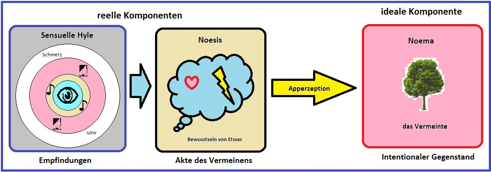

#lead/computationalphilosophy

Noesis and noema are the two correlative sides of one intentional act in [Husserl](https://en.wikipedia.org/wiki/Edmund_Husserl)'s [phenomenology](../../003_education/kcl/03_mental_health_in_the_community/phenomenology.md). They are not a process and its product. **Noesis** is the intending: perceiving, judging, remembering, including the way the act posits its object. **Noema** is the object as intended — the perceived as perceived, the judged as judged — not a theme extracted afterwards, and not the real thing the act happens to be about.

## Correlation, not Production

The diagram separates what is real in the stream from what is ideal. Sensuous hyle and the noesis are *reell*: colour, tone, pain, and the act that takes them up, as occurrences in the experience. This hyle is not Aristotelian matter. It is the raw sensory moment, not yet a feature of an object. The noema is ideal: *das Vermeinte*, what is meant. Apperception is not a later manufacturing step. It is the noesis taking up that sensory moment and intending an object through it. The arrow marks the correlation. It does not mean the noema is an output you walk away with.

## What the Noema is not

- **Not the real object.** The tree can burn. The noema of seeing the tree cannot. In *Ideas I*, the perceived as perceived is not identical with the transcendent thing.
- **Not a mental product.** Extracting themes from a book is a further act, with its own noesis and its own noema. Those themes are not the noema of the reading.
- **Not the sensation.** Sensation is hyletic. It is consciousness *of* something only as the noesis apperceives it.

## Reading

- **Noesis**: reading the sentence, and the way that reading posits it — as asserting, doubting, or merely entertaining.
- **Noema**: the state of affairs as meant in that reading, the sense through which the sentence is understood.
- Writing the themes down afterwards is a new act. Its noema is those themes as intended, not the noema of the first reading.
