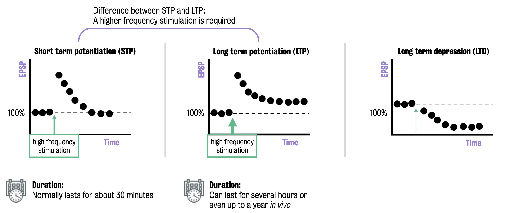
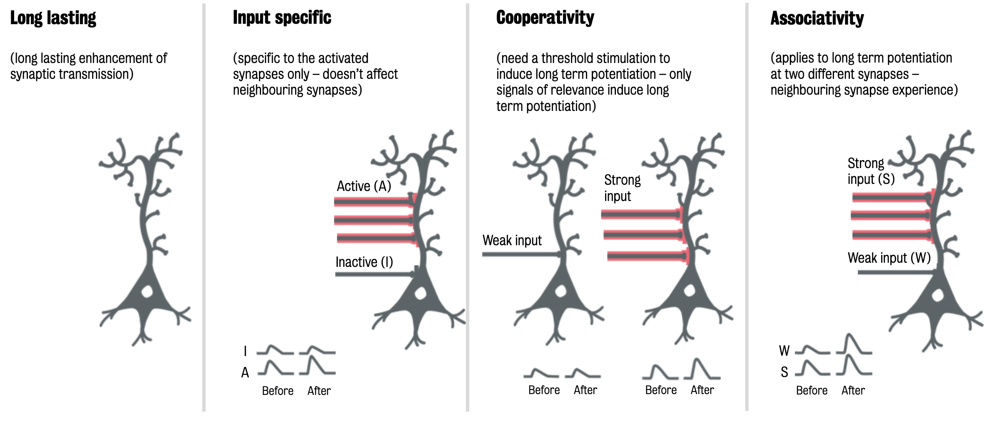

#core/appliedneuroscience

Activity-dependent plasticity is the **adaptive process of the brain, changing in response to experiences, behaviours, and stimuli.** This plasticity is crucial for the nervous system as it enables adaptability, learning, and recovery from injury.

## Types of Activity-Dependent Plasticity

### Long-Term Potentiation (LTP)

- [Long-term](../../../003_education/kings%20college/02%20Psychological%20Foundations/Long-term%20memory.md) potentiation is the process of strengthening synapses based on recent patterns of activity. (There is also a short-term potentiation (STP)).
- It is considered one of the brain’s primary mechanisms for memory storage.

Here are some properties of LTP:

### Long-Term Depression (LTD)

- LTD is the process that reduces the strength of synaptic transmission, the opposite of LTP.
- It can help remove old or less useful information, making space for new learning and memories.

### Homeostatic Plasticity

- Homeostatic plasticity helps to maintain the overall activity of neural networks within certain bounds.
- It prevents the networks from becoming too active or too quiet, playing a vital role in stabilising neural function.

#### [Synaptic Plasticity](../../../003_education/kings%20college/04%20Biological%20Foundations%20of%20Mental%20Health/Synaptic%20plasticity.md)

- [Synaptic plasticity](../../../003_education/kings%20college/04%20Biological%20Foundations%20of%20Mental%20Health/Synaptic%20plasticity.md) is a subset of homeostatic plasticity, specifically referring to changes in the efficiency or strength of synaptic transmission.
- It includes long-term potentiation (LTP) and long-term depression (LTD), adjusting synaptic strength in response to increases or decreases in neural activity.
- This plasticity plays a key role in learning and memory and in fine-tuning synaptic connections to maintain network stability.

#### Intrinsic Plasticity

- Intrinsic plasticity involves changes in the neuron’s intrinsic excitability independent of synaptic activity.
- This form of plasticity adjusts the neuron’s response to inputs, often by altering the expression of [ion channels](../../../003_education/kings%20college/01%20Techniques%20in%20Neuroscience/Ion%20channels.md) or modifying the neuron’s internal regulatory mechanisms.
- Intrinsic plasticity is a complementary mechanism to [synaptic plasticity](../../../003_education/kings%20college/04%20Biological%20Foundations%20of%20Mental%20Health/Synaptic%20plasticity.md), contributing to the homeostasis of neural circuits and the overall adaptability of the brain.

### Structural Plasticity

- Structural plasticity involves changes in the brain’s physical structure.
- Changes can include the growth of new neurons ([Neurogenesis](../../../003_education/kings%20college/04%20Biological%20Foundations%20of%20Mental%20Health/Neurogenesis.md)), the formation of new neural connections ([synaptogenesis](../../../003_education/kings%20college/04%20Biological%20Foundations%20of%20Mental%20Health/Synaptogenesis.md)), or the pruning away of less-used connections (synaptic pruning).

## Key Principle

Activity-dependent plasticity is not a passive process but is actively regulated by neural activity. The principle of “use it or lose it” applies here. The more a particular neural pathway is used, the stronger it becomes. Conversely, a pathway may weaken or disappear if it is not used. This mechanism allows the brain to continually adapt and optimise itself in response to the individual’s environment and experiences.
