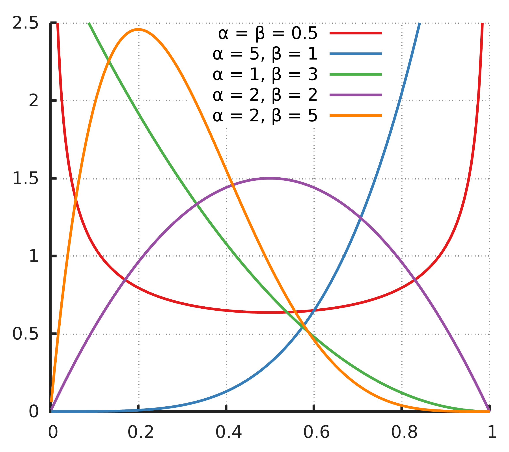

#core/artificialintelligence

The Beta distribution is a family of **continuous probability distributions defined on the interval [0, 1].** It’s characterised by two shape parameters, often denoted as `α` (alpha) and `β` (beta).

## Definition

The probability density function (PDF) of a Beta distribution is given by:

$$
f(x; α, β) = (x^(α - 1) * (1 - x)^(β - 1)) / B(α, β)
$$

Where:

- `x` is a random variable that is between 0 and 1,
- `α` and `β` are the shape parameters,
- `B(α, β)` is the Beta function, defined as `B(α, β) = Γ(α) * Γ(β) / Γ(α + β)`,
- `Γ` is the Gamma function, which generalises the factorial function to complex numbers.

## Mean and Variance

The **mean** (expected value) and **variance** of a Beta distribution are:

- Mean: `μ = α / (α + β)`
- Variance: `σ^2 = (α * β) / [ (α + β)^2 * (α + β + 1) ]`

## Properties

The Beta distribution has several interesting properties:

1. **Flexibility**: By adjusting the shape parameters `α` and `β`, the Beta distribution can take on many different shapes, including uniform, bell-shaped, left or right-skewed, and U-shaped distributions.
2. **Boundedness**: The Beta distribution is defined on the interval [0, 1], making it useful for modelling variables that are percentages, proportions, or probabilities.
3. **Conjugate Prior**: In Bayesian statistics, the Beta distribution is the conjugate prior probability distribution for the Bernoulli, binomial, negative binomial, and geometric distributions.

## Applications

The Beta distribution is widely used in various fields:

- In **Bayesian statistics**, it’s used as a prior distribution for the probability of success in a Bernoulli trial (since it’s a conjugate prior).
- In **machine learning**, it’s used in algorithms like Latent Dirichlet Allocation (LDA) and other Dirichlet-multinomial models.
- In **project management**, it’s used in PERT (Program Evaluation and Review Technique) to model time estimates.

## Example

Suppose you have a random variable `X` that follows a Beta distribution with parameters `α = 2` and `β = 3`. The probability density function would be:

$$
f(x; 2, 3) = (x^(2 - 1) * (1 - x)^(3 - 1)) / B(2, 3)
$$
