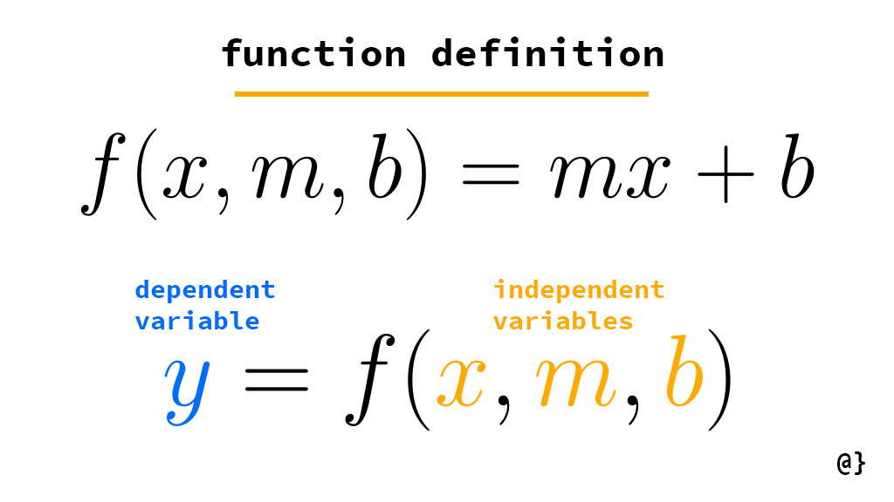

#fundamental/logic

A dependent variable is a variable that is affected by the independent variable. It is the output of the function.

- An independent variable is a variable that is not affected by any other variable. It is the input of the function.
- The relationship between the independent and dependent variables can be expressed as a mathematical equation.
- The independent variable is usually represented by the letter x, while the dependent variable is usually represented by the letter y.
- The value of the dependent variable changes when the value of the independent variable changes.
