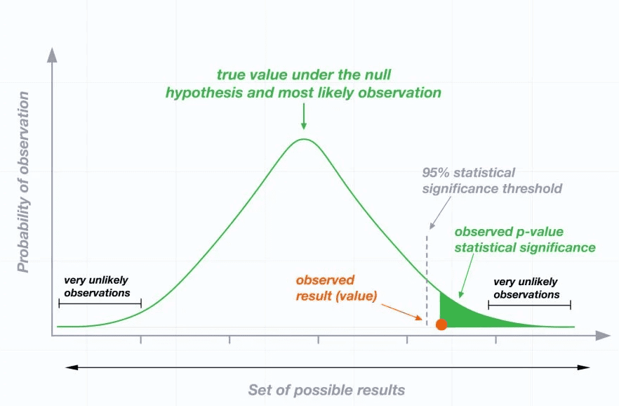

#core/artificialintelligence #core/mathematicalphysics

The p-value is a key concept in statistics, typically used in hypothesis testing. It **quantifies the evidence against a specified statistical model,** such as a null hypothesis.

## Definition

The p-value is the **probability of obtaining a result equal to or more extreme than what was actually observed,** assuming the null hypothesis is true. It is a number between 0 and 1; the smaller the p-value, the stronger the evidence that you should reject the null hypothesis.

## Key Points

- **Null Hypothesis (H0)**: This is a general statement or default position that there is no relationship between two measured phenomena. Hypothesis testing usually begins with an assumption called the null hypothesis, which proposes that there’s no statistical relationship or significance between sets of observed data.
- **Alternative Hypothesis (H1)**: This is what you might believe to be true or hope to prove true. It contradicts the null hypothesis.
- **Significance Level (α)**: This is the probability of rejecting the null hypothesis when it is true. In other words, it’s the level of risk you’re willing to take in rejecting the null hypothesis. It’s often set at 0.05, meaning there’s a 5% chance you’ll reject the null hypothesis when it’s actually true.

## Interpretation

We reject the null hypothesis if the p-value is less than or equal to the significance level (α). This suggests that our observed data is inconsistent with the assumption of the null hypothesis being true, providing evidence for the alternative hypothesis.

We fail to reject the null hypothesis if the p-value is greater than α. This does not necessarily mean that the null hypothesis is true, only that we do not have enough evidence to reject it.

> [!example]
> For instance, if you’re comparing two groups (e.g., a control group and a treatment group) to see if there is a difference between them, the null hypothesis would be “There is no difference between the groups.” A p-value of 0.03 would mean there is a 3% chance of obtaining the observed data (or data more extreme) if the null hypothesis were true. If you set your significance level at 0.05, you would reject the null hypothesis and conclude there is a significant difference between the groups.

> [!warning]
> While the p-value can be a useful statistical measure, it’s important to interpret it correctly:
> - The p-value does not indicate the size or importance of the observed effect. A small p-value does not mean the effect is large or important, and a large p-value does not mean the effect is small or unimportant.
> - The p-value is not the probability that the null hypothesis is true. Rather, it’s the probability of observing your data (or more extreme data) if the null hypothesis is true.
> - P-values can be influenced by sample size. With very large samples, you might find statistical significance (i.e., a small p-value) even for very small differences or effects that may not be meaningful in practical terms.
