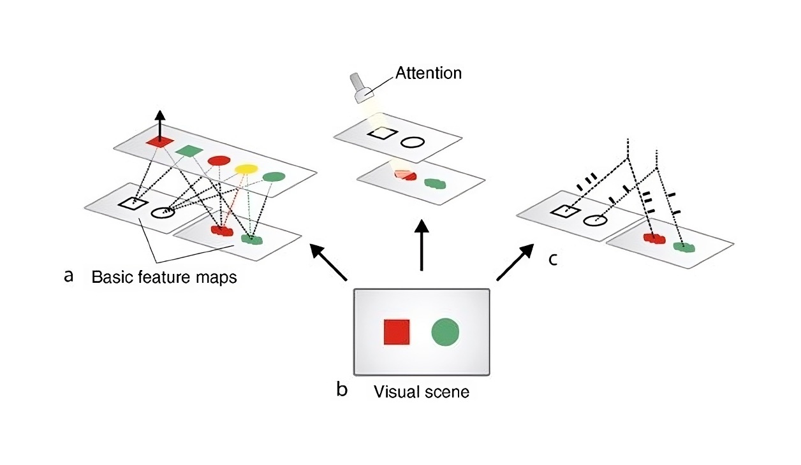

#core/artificialintelligence #core/appliedneuroscience

The massive binding problem refers to the challenge of **explaining how the brain integrates diverse sensory inputs and cognitive processes** to create a unified, coherent experience of consciousness.

## Key Aspects

1. **Sensory Integration**: Combining information from different sensory modalities.
2. **Feature Binding**: Unifying various features of an object into a coherent representation.
3. **Temporal Binding**: Maintaining continuity of experience across time.
4. **Cognitive Binding**: Integrating higher-level cognitive processes with sensory and motor information.
5. **Unity of [Consciousness](../Sizing%20Up%20Consciousness/Levels%20of%20cognitive%20complexity.md#consciousness)**: Explaining the emergence of a unified subjective experience.

## In Neuroscience

- Involves understanding how distributed neural processes create global conscious experiences.
- Challenges traditional localisationist views of brain function.
- Relates to theories of consciousness (e.g., Global Workspace Theory, [Integrated Information Theory](../../videos/Integrated%20information%20theory.md)).

## In Cognitive Architectures

- Attempts to model entire cognitive systems, including perception, reasoning, and action.
- Must address how different modules or processes interact and integrate information.
- Often implements attention mechanisms as a potential solution to binding.

## Nengo and Neural Engineering Framework (NEF)

1. **Nengo**: A neural engineering framework for building large-scale brain models and cognitive architectures.
   - Allows implementation and testing of binding theories in neural systems.
   - Provides tools for representing and manipulating complex, bound information.
2. **Neural Engineering Framework**:
   - Offers methods for representing and transforming information in neural populations.
   - Can be used to implement binding operations in a neurally plausible way.
3. **Semantic Pointers**:
   - A concept used in [Nengo](https://www.nengo.ai/) to represent and manipulate complex, bound information.
   - Combines aspects of symbolic and subsymbolic approaches to cognition.
4. **[Vector](../Neural%20Networks%20from%20Scratch/Column%20and%20row%20vectors.md) Symbolic Architectures (VSA)**:
   - Used to represent and manipulate structured information in high-dimensional vector spaces.
   - Provides a potential mechanism for binding in neural systems.

## Approaches to Solving the Binding Problem

1. **Temporal [Synchrony](../_%20general%20knowledge/Interbrain%20synchrony.md)**: Binding through synchronised neural firing.
2. **Convergence Zones**: Specialised brain regions that integrate information.
3. **Attentional Mechanisms**: Selective enhancement and integration of relevant information.
4. **Predictive Coding**: Binding through prediction and error correction in hierarchical systems.
5. **Global Workspace Models**: Broadcasting bound information to a “global workspace”.
