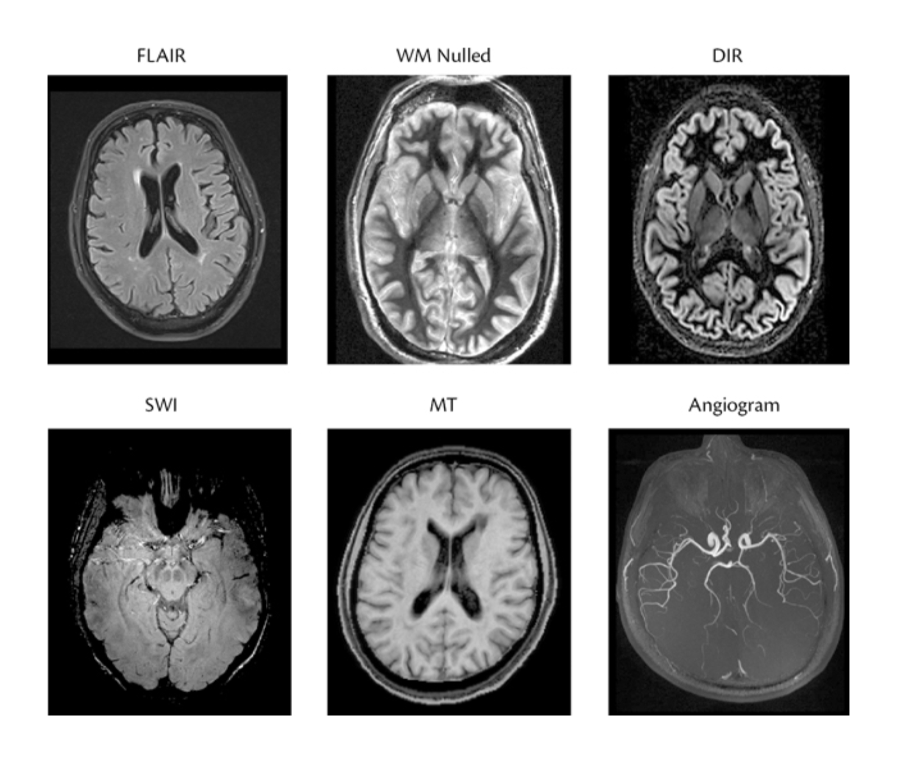

#core/appliedneuroscience 

## **FLAIR (Fluid-Attenuated Inversion Recovery)**

- **Usage**: Commonly used in brain imaging to detect periventricular hyper-intense lesions, such as multiple sclerosis plaques. It suppresses cerebrospinal fluid (CSF) signals to enhance lesion visibility.
- **Mechanism**: Uses an inversion recovery pulse sequence with a carefully chosen inversion time (TI). This suppresses the signal from fluids like CSF by nulling their magnetisation during imaging, improving contrast between brain tissue and CSF.

---

## **DIR (Double Inversion Recovery)**

- **Usage**: Provides high contrast resolution between grey matter (GM) and white matter (WM). It is particularly useful for detecting cortical and subcortical lesions in [central nervous system](../../../003_education/kings%20college/04%20Biological%20Foundations%20of%20Mental%20Health/Central%20nervous%20system.md) diseases.
- **Mechanism**: Applies two 180° inversion radio-frequency pulses to suppress two tissue types simultaneously (e.g., WM and CSF or GM and CSF). This selective suppression enhances the conspicuity of specific tissue types.

---

## **SWI (Susceptibility-Weighted Imaging)**

- **Usage**: Sensitive to paramagnetic substances like deoxygenated blood and intracranial mineral deposits. Used for diagnosing venous abnormalities, intracranial haemorrhage, traumatic brain injury, stroke, neoplasms, and multiple sclerosis.
- **Mechanism**: Combines magnitude and phase data from gradient echo sequences to enhance contrast based on differences in magnetic susceptibility. SWI highlights venous structures and mineral deposits through minimum intensity projections.

---

## **MT (Magnetisation Transfer Imaging)**

- **Usage**: Detects subtle changes in brain tissues not visible with standard MRI techniques. Used for measuring magnetisation transfer ratios (MTR), which reflect macromolecular-bound protons and free water compartments. Commonly applied in neurodegenerative disease research.
- **Mechanism**: Exploits interactions between free protons (mobile water) and bound protons (macromolecules). Bound protons are normally invisible in MR imaging but can be indirectly measured via their effect on free proton signals.
---

## **MRA (Magnetic Resonance Angiography)**

- **Usage**: Non-invasive imaging of blood vessels to evaluate vascular conditions like stenosis or aneurysms. Preferred over CT angiography due to the absence of ionising radiation.
- **Mechanism**: Techniques like TOF (Time-of-Flight) or QISS (Quiescent Interval Slice Selection) use saturation pulses to null background tissue signals while enhancing arterial blood flow signals. These methods rely on the inflow effect of unsaturated blood during systole.
