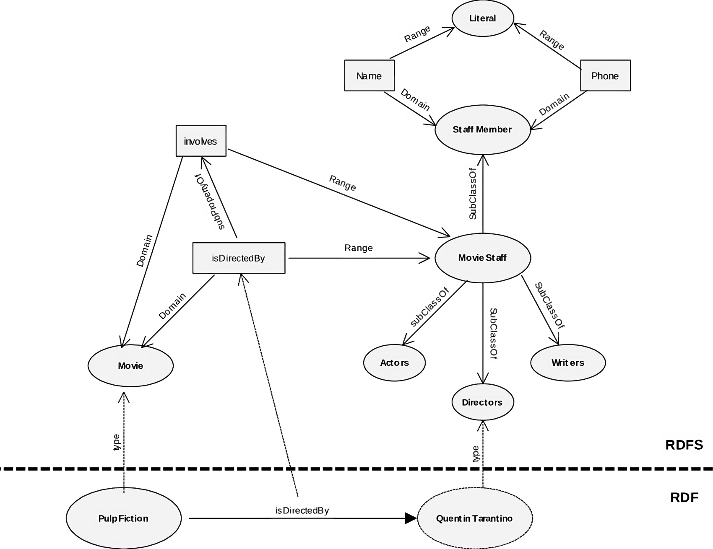

#core/softwaredevelopment

RDF and RDFS are foundational **W3C standards for representing knowledge as graphs.** RDF gives you a simple, flexible data model based on triples that can be serialised and exchanged on the Web. RDFS builds on that by providing a lightweight schema (vocabulary) layer for defining classes, properties, and hierarchies, enabling basic reasoning so that some facts can be inferred from others. Together, they let you describe resources and then add meaning that machines can use consistently across datasets.

## RDF (Resource Description Framework)

- **Purpose:** Standard model for data interchange on the Web.
- **Structure:** Uses triples (subject, predicate, object) to describe resources.
- **Flexibility:** Encodes, exchanges, and reuses structured metadata.

## RDFS (RDF Schema)

- **Purpose:** Semantic extension of RDF for describing resource relationships and vocabularies.
- **Structure:** Introduces classes and properties to define relationships.
- **Enhancements:** Adds hierarchy and inferencing capabilities to RDF’s descriptive model.
