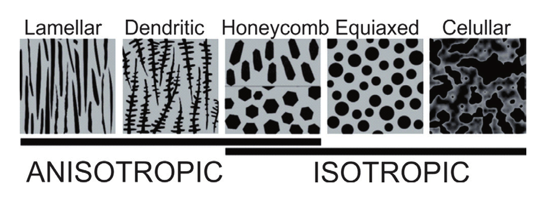

#core/appliedneuroscience

Anisotropic microstructures are **materials with direction-dependent properties**, which are crucial in replicating the natural architecture of biological tissues. These structures are often utilised in tissue engineering to mimic the anisotropy found in native tissues like muscles, bones, and nerves.

## Importance in Tissue Engineering

- **Native Tissue Mimicry**: Many biological tissues exhibit anisotropic properties. For example:
  - **Muscles**: Aligned fibres for directional contraction.
  - **Bones**: Gradient mechanical properties for load-bearing.
  - **Nerves**: Axonal alignment for effective signal conduction.
- **Cell Behaviour Modulation**: Anisotropic cues influence:
  - Cell adhesion.
  - Migration.
  - Differentiation.

## Methods to Create Anisotropic Microstructures

1. **Electrospinning**:
   - Produces aligned nanofibres for scaffolds.
   - Commonly used polymers: PLGA, PCL, and collagen.
   - Applications: Muscle and nerve tissue engineering.

2. **3D [Bioprinting](../../../003_education/kings-college/05%20Neuroscience%20in%20Society/Bioprinting.md)**:
   - Controlled deposition of biomaterials to create aligned patterns.
   - Offers high precision and customisation.

3. **Mechanical Stretching**:
   - Stretching polymer scaffolds during fabrication induces fiber alignment.
   - Enhances mechanical properties and anisotropy.

4. **Micro-grooving**:
   - Laser ablation or lithography creates grooves on scaffold surfaces.
   - Guides cell alignment and tissue organisation.

## Properties of Anisotropic Microstructures

- **Mechanical**:
  - Higher tensile strength along aligned directions.
  - Differential stiffness mimics native tissues.
- **Topographical**:
  - Surface roughness and patterns enhance cell attachment.
- **Biochemical**:
  - Gradients of biomolecules can be incorporated for directional growth.
