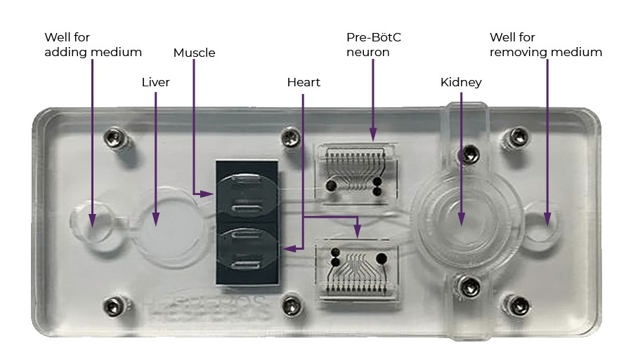

#core/appliedneuroscience 

Human-on-a-chip systems are innovative **microfluidic devices that combine several miniature organ models to simulate the interactions and functions of the human body.** By connecting organ-specific cell cultures with channels that mimic blood flow, these platforms allow researchers to study drug effects, disease processes, and toxicity in a way that closely resembles human physiology—offering a promising alternative to traditional animal testing.

## Key Features

- **Microfluidic channels:** Mimic blood flow between organ compartments.
- **Organ mimics:** Use human cells (e.g., liver, lung, kidney, heart).
- **Mechanical forces:** Simulate breathing, heartbeat, peristalsis, etc.

## Main Functions

- **Multi-organ pharmacokinetics:** Study drug metabolism and effects across organs.
- **Disease modelling:** Replicate human diseases and infections.
- **Toxicity screening:** Detect harmful drug effects on multiple organs.

## Applications

- **Drug development:** Predict human drug responses (e.g., Emulate Bio, Roche).
- **Personalised medicine:** Test patient-specific drug reactions.
- **Defense research:** Study effects of toxins/radiation (e.g., DARPA projects).

## Challenges

- **Universal culture media:** Needed for supporting different cell types.
- **Integration:** Linking more organs for full-body simulation.
- **Validation:** Correlating chip data with real clinical outcomes.