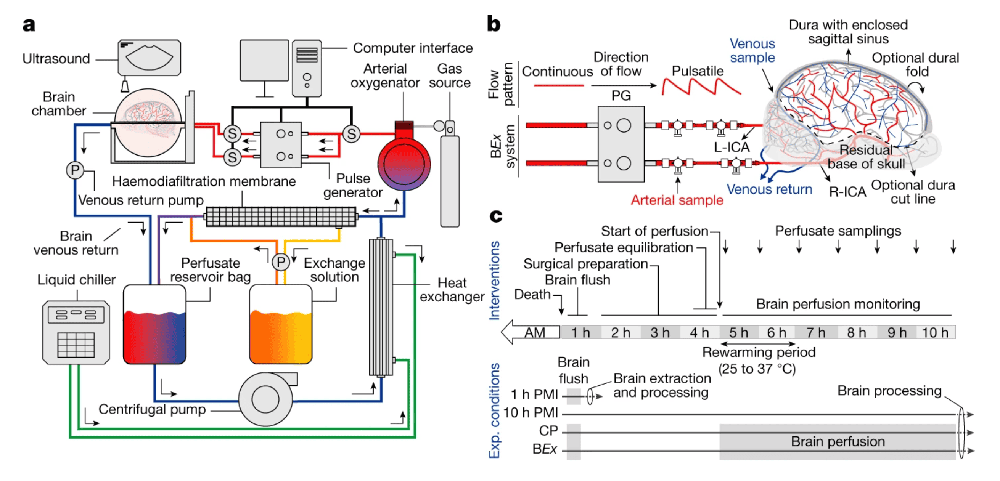

#core/appliedneuroscience #core/artificialintelligence

An ex cranio brain is **a brain that has been removed from the body.** It is used in scientific research to describe situations where brain activity supports consciousness even when fully isolated from the body and its environment. For example, in a study, researchers restored blood flow to brain cells, cellular functions of neurons, and spontaneous synaptic activity in pigs’ brains that were removed after death and connected to a system called BrainEx.
