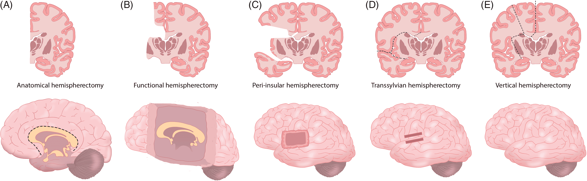

#core/theoreticalneurosurgery #core/appliedneuroscience

Hemispherotomy is a surgical procedure used in the treatment of severe and intractable epilepsy. It is a modified version of [hemispherectomy](https://en.wikipedia.org/wiki/Hemispherectomy), which involves **removing or disconnecting one of the brain’s hemispheres.** Hemispherotomy, by contrast, aims to preserve more of the brain’s structure while still achieving the desired disconnection to control seizures.

## Indications

Hemispherectomy is typically indicated for patients with epilepsy that are localised to one hemisphere of the brain and do not respond to medication. Common conditions leading to this procedure include:

- Rasmussen’s encephalitis
- Sturge-Weber syndrome
- Hemimegalencephaly
- Extensive cortical dysplasia
- Post-traumatic epilepsy
- Perinatal stroke leading to extensive unilateral brain damage

## Procedure

The goal of hemispherotomy is to disconnect the epileptogenic hemisphere from the rest of the brain, thereby preventing seizure propagation. The procedure involves:

1. **Surgical Access**: A [craniotomy](../The%20Feeling%20of%20Life%20Itself/Craniotomy.md) is performed to access the affected hemisphere.
2. **Disconnection**: Key structures such as the [corpus callosum](../../../003_education/kings%20college/05%20Neuroscience%20in%20Society/Corpus%20callosum.md), internal capsule, and [basal ganglia](../../../003_education/kings%20college/04%20Biological%20Foundations%20of%20Mental%20Health/Basal%20ganglia.md) are surgically disconnected. Unlike hemispherectomy, large parts of the brain tissue are not removed, reducing the risk of hydrocephalus and other complications.
3. **Preservation**: Where possible, brain tissue is preserved to minimise the impact on cognitive and motor functions.

## Outcomes

The success rate of hemispherotomy in reducing or eliminating seizures is high, often exceeding 80% in properly selected patients. However, the procedure may lead to or exacerbate existing deficits, particularly in:

- Motor control, leading to hemiparesis on the side opposite the surgery
- Sensory functions, including vision, touch, and [proprioception](../../../004_subsidiary/courses/Udemy/Neuroanatomy/Proprioception.md)
- Language and cognitive functions, depending on the hemisphere involved and the age of the patient

## Rehabilitation

Post-surgical rehabilitation is crucial for maximising recovery and adaptation. This may include:

- Physical therapy to improve motor function and mobility
- Occupational therapy for daily living skills
- Speech therapy, especially for left hemispherotomy in language-dominant individuals
- Cognitive rehabilitation to support learning and memory

## Implications for Consciousness

Hemispherotomy provides striking empirical evidence for [substrate independence](../How%20To%20Build%20a%20Brain/Multiple%20realisability.md) of consciousness. Patients retain unified conscious experience despite:

- **~50% neural substrate reduction** — The disconnected hemisphere remains physically present but functionally isolated, demonstrating that conscious experience does not require the full original substrate
- **Preserved phenomenal unity** — Patients report continuous first-person experience, not a "halved" consciousness, supporting theories that consciousness emerges from integrated information patterns rather than raw neural mass
- **Maintained sense of self** — Personal identity and autobiographical continuity persist through radical neural reorganisation

> [!tip] Relevance to Substrate Transfer
> For [Progressive Synthetic Neural Substrate Transfer](../../_%20general%20knowledge/PSNST.md), hemispherotomy demonstrates that:
> 1. Consciousness can survive major substrate changes when functional organisation is preserved
> 2. Gradual transition (vs. instantaneous) allows neural plasticity to maintain integration
> 3. The "minimum viable substrate" for consciousness may be far smaller than the intact brain

### Theoretical Connections

| Theory | Hemispherotomy Evidence |
|--------|------------------------|
| [Integrated information theory](../../videos/Integrated%20information%20theory.md) | Φ (phi) depends on integrated information, not volume—remaining hemisphere maintains high integration |
| [Higher-order theories of consciousness](Higher-order%20theories%20of%20consciousness.md) | Metacognitive functions preserved in remaining hemisphere sufficient for conscious access |
| [Fading qualia](../From%20Biological%20to%20Artificial%20Consciousness/Fading%20qualia.md) | Supports Chalmers' organisational invariance—if function preserved, experience preserved |

### Open Questions

- Does the disconnected hemisphere retain any form of isolated consciousness?
- How does PCI change pre- vs. post-surgery?
- What is the minimum cortical volume required for unified conscious experience?

## Surgical Variants

The embedded diagram illustrates five approaches with varying degrees of tissue removal vs. disconnection:

| Approach | Method | Tissue Removed |
|----------|--------|----------------|
| Anatomical hemispherectomy | Complete removal | Entire hemisphere |
| Functional hemispherectomy | Partial removal + disconnection | Temporal lobe, central cortex |
| Peri-insular hemispherotomy | Disconnection around insula | Minimal |
| Transsylvian hemispherotomy | Access via Sylvian fissure | Minimal |
| Vertical hemispherotomy | Superior approach to ventricles | Minimal |

Modern preference favours disconnective techniques (hemispherotomy) over anatomical removal due to reduced complications while achieving equivalent seizure control.

## Key Researchers

| Researcher | Contribution |
|------------|--------------|
| **Walter Dandy** | Performed first hemispherectomy (1923) for glioma |
| **Kenneth McKenzie** | First hemispherectomy for epilepsy (1938) |
| **Jean-Guy Villemure** | Developed peri-insular hemispherotomy technique |
| **Johannes Schramm** | Pioneered transsylvian hemispherotomy |
| **Giulio Tononi** | [Integrated information theory](../../videos/Integrated%20information%20theory.md) provides theoretical framework for understanding preserved consciousness |
