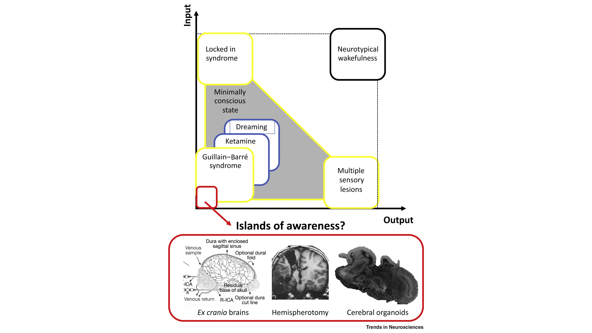

#core/appliedneuroscience #core/artificialintelligence

The concept explores the **existence of consciousness independent of sensory inputs and motor outputs**, focusing on scenarios like [Ex cranio brains](Ex%20cranio%20brains.md), [hemispherotomy](Hemispherotomy.md), and cerebral organoids. It delves into the detection of such isolated consciousness and its broader implications for understanding the nature of consciousness itself, along with ethical considerations. This notion **challenges traditional views on consciousness’s dependency on environmental interactions**, posing significant questions about the intrinsic aspects of conscious experience.

## Detection Methods

Detecting consciousness in isolated systems presents unique challenges:

 **Behavioural assays** become impossible when the system has no motor outputs. Researchers must rely on neural markers instead.
 **PCI (Perturbational Complexity Index)** measures the causal interaction between cortical areas in response to transcranial magnetic stimulation. High PCI values correlate with conscious awareness.
 **Neural complexity metrics** (based on [integrated information theory](../../videos/Integrated%20information%20theory.md)) can distinguish between conscious and unconscious states by analysing patterns of information integration.
 **Response to stimuli** even without environmental input: can internally generated neural activity patterns resemble those seen in conscious waking states?

## Ethical Considerations

The possibility of isolated consciousness raises profound ethical questions:

 **Moral status**: If a disconnected hemisphere or ex cranio brain exhibits conscious-like activity, does it possess moral status? At what threshold?
 **Research ethics**: Does experimenting on potentially conscious isolated systems require the same protections as research on living subjects?
 **Intentional creation**: If we create artificial systems (like large-scale cerebral organoids) that might support consciousness, what obligations do we have?
 **Termination protocols**: Should there be ethical guidelines for shutting down systems that might be conscious?

## Connection to Extracorporeal Cognitive Preservation

The island of awareness concept directly informs [Extracorporeal Cognitive Preservation](../../_%20general/Extracorporeal%20Cognitive%20Preservation.md) thinking:

 If consciousness can persist in isolated neural substrates, gradual substrate replacement becomes more plausible
 The minimum viable substrate for consciousness may be far smaller than a full brain
 Understanding what constitutes "sufficient integration" is critical for designing synthetic substrates that preserve experience

> [!tip] Key Insight
> The island of awareness framework suggests that consciousness is **organisationally invariant** - it persists as long as the functional relationships that generate experience are maintained, regardless of the specific physical substrate.
