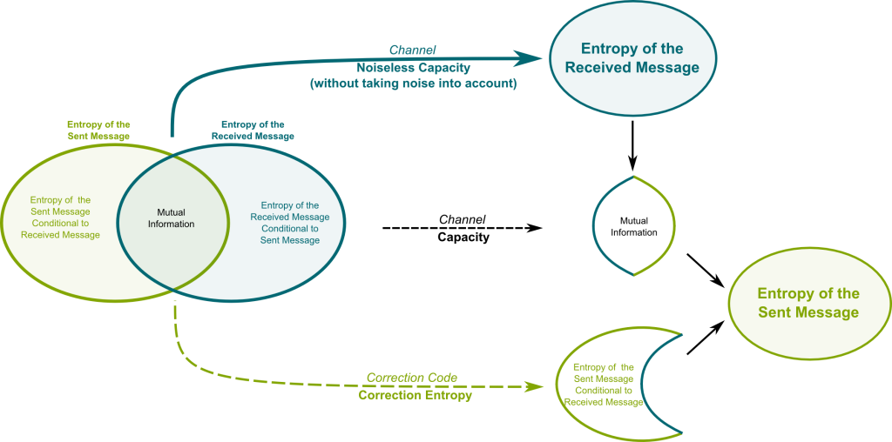

#core/softwaredevelopment #core/appliedneuroscience

1. **Definition**: Shannon information quantifies the amount of uncertainty or surprise in a random variable.
2. **Entropy**: Measure of average information content in a message.
   - Formula: H(X) = -Σ p(x) log₂ p(x)
   - Units: bits (when using log₂)
3. **Properties**:
   - Non-negative
   - Additive for independent events
   - Maximal for uniformly distributed events

## Key Principles

1. **Uncertainty Reduction**: Information is gained when uncertainty is reduced.
2. **Probabilistic Nature**: Based on probabilities of events/messages.
3. **Channel Capacity**: Maximum rate of reliable information transmission.

## Relation to [Integrated Information Theory](../../videos/Integrated%20information%20theory.md) (IIT)

1. **Foundation**: Serves as a starting point for IIT’s concept of information.
2. **Contrast**:
   - Shannon: Statistical properties of messages
   - IIT: Causal and intrinsic nature of information in a system
3. **Extension**: IIT introduces “integrated information” (Φ) to capture consciousness-relevant aspects.
4. **Measurement**:
   - Shannon: Bits of transmitted data
   - IIT: Φ (phi) as a measure of integrated information

## Key Differences from IIT’s Perspective

1. **Intrinsicality**: IIT focuses on information intrinsic to a system, not dependent on an external observer.
2. **Integration**: IIT emphasises irreducible information integration, beyond mere information presence.
3. **Causality**: IIT considers the causal structure of information, not just its statistical properties.
4. **Exclusion**: IIT introduces the concept of exclusive, definite causal structure.
