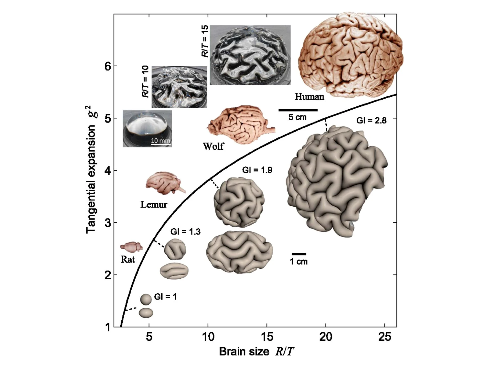

#core/appliedneuroscience 

Gyrification and brain folding are terms used to describe **the process of the brain’s cortex becoming more convoluted or folded.** This process is believed to increase the surface area of the brain’s cortex, allowing for more neurons and synapses to be packed into the same area. This increased complexity of the brain’s cortex is believed to be associated with increased cognitive abilities in humans. Gyrification and brain folding are also seen in other mammals, such as cats and dogs, but are most pronounced in humans.
