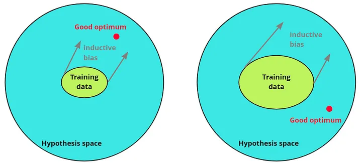

#core/artificialintelligence 

Inductive bias in machine learning refers to the **inherent set of assumptions or preferences that a learning algorithm employs to generalise from training data to unseen inputs**, enabling predictions despite incomplete information. This bias guides the model in selecting one hypothesis over others that fit the observed data equally well, playing a crucial role in effective learning and preventing overfitting by incorporating prior knowledge about the problem domain.

## Key Concepts

- **Role in [Generalisation](../../../003_education/kings%20college/02%20Psychological%20Foundations/Generalisation%20gradient.md)**: Allows algorithms to make inductive leaps from finite datasets to broader patterns; without it, learning would be impossible as infinite hypotheses could fit the data.
- **Types**: Includes architectural biases (e.g., CNNs favoring spatial hierarchies for images) and algorithmic biases (e.g., decision trees preferring simpler splits); can be explicit (e.g., regularisation) or implicit (e.g., model structure).
- **Relation to Bias-Variance Tradeoff**: Strong inductive bias reduces variance but may increase bias if assumptions don't match the true data distribution; weak bias allows flexibility but risks overfitting.
- **Examples**: In neural networks, activation functions or layer types impose biases; in SVMs, the kernel choice assumes data separability in higher dimensions.

## Implications

- **Prototyping and Model Selection**: Guides efficient ML development by choosing biases aligned with domain knowledge, accelerating convergence and improving performance.
- **Limitations**: Poorly chosen biases lead to underperformance; modern approaches like meta-learning aim to learn biases from data.