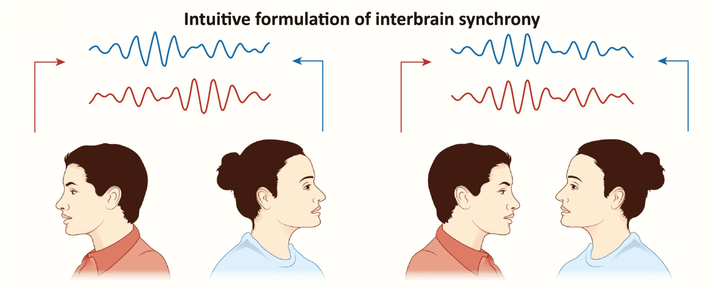

#core/appliedneuroscience

Interbrain synchrony refers to the **phenomenon in which the brains of two or more individuals synchronise or show similar patterns of activity when they interact** or engage in communication. It suggests a level of neural coherence and coordination between individuals and is believed to play a role in social bonding, [empathy](../../social-media/linkedin/spectrum_of_empathy.md), and understanding between people.

Measured via **hyperscanning** — simultaneously recording from two or more participants using fNIRS or EEG — the mechanism is **neural coupling**: the listener's brain activity mirrors the speaker's with a short temporal lag. Pioneered by Uri Hasson (Princeton, 2004), stronger coupling correlates with better communication outcomes.
