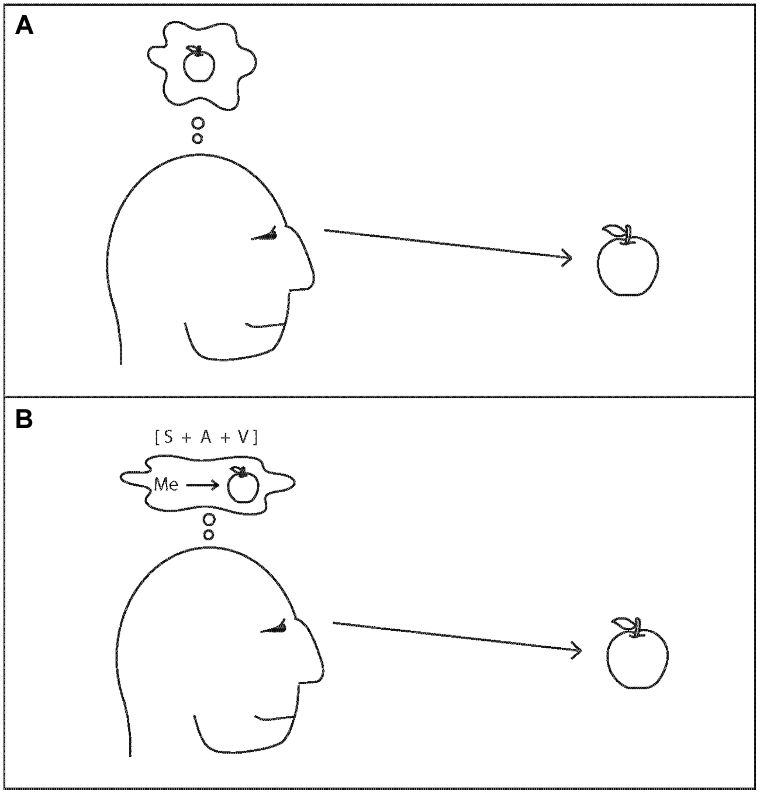

#core/artificialintelligence #core/appliedneuroscience

[Michael Graziano](https://en.wikipedia.org/wiki/Michael_Graziano)'s attention schema theory (AST) posits that **conscious awareness is a simplified internal model the brain constructs of its own attentional processes** — a "caricature" of attention, not a faithful report. Awareness, on this view, is not a metaphysical property or an emergent mystery but a useful, imperfect self-model the brain uses to predict and control its own focus.

## Key Points

1. The brain has specialised networks for controlling [attention](../../../003_education/kings-college/02_psychological_foundations/endogenous_and_exogenous_attention.md) — selecting what sensory information to prioritise.
2. Alongside attentional control, the brain constructs an **attention schema**: a simplified, schematised model of the attention process itself.
3. This model is a caricature, not an accurate depiction — much as the brain's model of a coffee cup is a compressed representation, not a pixel-perfect reconstruction.
4. The schema includes the notion of a non-physical entity — what we label "awareness" or "consciousness" — as a modelling convenience.
5. The caricature enables the brain to predict the effects of different attention states and reason about them socially (what is _this_ person attending to? what might _I_ attend to next?).
6. Subjective experience _is_ this caricature model running — we experience the schema, not the underlying attention mechanisms directly.

## How AST Differs

Unlike [Integrated Information Theory](../../videos/integrated_information_theory.md) (which ties consciousness to informational-causal architecture) or Global Workspace Theory (which frames it as global broadcast across neocortical networks), AST treats consciousness as a _model_ — a representation, not a substance or a computation. It is closer to higher-order theories in claiming consciousness arises from a brain system representing its own states, but AST grounds the represented content specifically in attention rather than in general mental states.

> [!warning] Limitation
> AST explains why we _report_ being conscious but does not explain why the model _feels like anything_ — the hard problem of consciousness remains. Graziano argues the "feel" is itself part of the model (the schema represents awareness as having qualitative character), but critics note this collapses the _representation_ of qualia into qualia themselves.

## Related Concepts

- [Integrated Information Theory](../../videos/integrated_information_theory.md) — consciousness as irreducible causal integration (contrast with AST's model-based account)
- [Neural correlate of consciousness](../the_feeling_of_life_itself/neural_correlate_of_consciousness.md) — what the brain is doing when consciousness occurs
- [Consciousness engineering](../../_general/consciousness_engineering.md) — AST's implication: if awareness is a model, it may be engineerable
- [Attention](../../../003_education/kings-college/02_psychological_foundations/endogenous_and_exogenous_attention.md) — the process AST claims consciousness models
