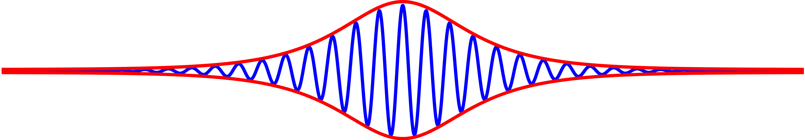

#core/computationalmathematics #core/appliedneuroscience

A **soliton** is a self-reinforcing solitary wave that propagates through a medium without changing shape or speed. It arises from the exact balance between **nonlinear** and **dispersive** effects — where nonlinearity tends to steepen the wave and dispersion tends to spread it, neither dominates at the precise soliton amplitude.

## Mathematical Characterisation

The archetypal model is the **Korteweg-de Vries (KdV) equation**, describing weakly nonlinear, weakly dispersive waves:

$$\frac{\partial u}{\partial t} + 6u\frac{\partial u}{\partial x} + \frac{\partial^3 u}{\partial x^3} = 0$$

Its exact one-soliton solution is a $\mathrm{sech}^2$ pulse:

$$u(x,t) = \frac{c}{2}\,\mathrm{sech}^2\!\left(\frac{\sqrt{c}}{2}(x - ct - x_0)\right)$$

Faster solitons ($c$ larger) are taller and narrower. For **envelope solitons** — as in optical fibres or Bose-Einstein condensates — the **Nonlinear Schrödinger (NLS) equation** governs:

$$i\frac{\partial \psi}{\partial t} + \frac{\partial^2 \psi}{\partial x^2} + 2|\psi|^2\psi = 0$$

with bright soliton solution $\psi(x,t) = A\,\mathrm{sech}(Ax)\,e^{iA^2t/2}$ (the image above depicts this envelope structure).

## Key Properties

- **Shape and speed preservation** — propagates without spreading or attenuation.
- **Elastic collisions** — two solitons pass through each other and emerge unchanged, save for a phase shift.
- **Integrability** — soliton-bearing equations admit exact multi-soliton solutions via the **Inverse Scattering Transform** (Gardner, Greene, Kruskal, Miura 1967).
- **Topological stability** — kink solitons of the Sine-Gordon equation ($\partial^2\varphi/\partial t^2 - \partial^2\varphi/\partial x^2 + \sin\varphi = 0$) carry a conserved topological charge.

## Heimburg-Jackson Model of Nerve Impulse

In contrast to the [Hodgkin-Huxley model](../../../003_education/epfl/02_computational_neuroscience/hodgkin-huxley_model.md), Heimburg and Jackson (2005) proposed that the action potential is a **mechanical density soliton** in the lipid bilayer, propagating near the gel-to-fluid phase transition. The governing equation is a modified Boussinesq form:

$$\frac{\partial^2 \Delta\rho}{\partial t^2} = \frac{\partial}{\partial x}\!\left[\left(c_0^2 + p\,\Delta\rho + q\,(\Delta\rho)^2\right)\frac{\partial\Delta\rho}{\partial x}\right] - h\,\frac{\partial^4\Delta\rho}{\partial x^4}$$

where $\Delta\rho$ is the density deviation from resting state and $c^2(\Delta\rho)$ is a nonlinear sound velocity that peaks near the phase transition. A key prediction is that the impulse is **adiabatic and reversible** — consistent with measured temperature fluctuations that cancel over a full spike, which is difficult to reconcile with the dissipative Hodgkin-Huxley picture.

## Davydov Solitons

Davydov (1973) proposed that energy from ATP hydrolysis is transported along $\alpha$-helical proteins as a **self-trapped amide-I quantum** (C=O stretching mode, ${\approx}0.21\,\mathrm{eV}$). Coupling between the vibrational exciton and lattice phonons deforms the helix around the excitation, forming a bound state that propagates without dispersion:

$$H = H_\mathrm{ex} + H_\mathrm{ph} + H_\mathrm{int}$$

Whether quantum coherence survives at 37 °C long enough for biologically meaningful transport remains contested.

## Cross-disciplinary Occurrences

| System | Governing equation | Soliton type |
| --- | --- | --- |
| Shallow water / plasma | KdV | Surface wave, ion-acoustic pulse |
| Optical fibre | NLS | Light pulse (telecommunications) |
| Bose-Einstein condensate | Gross-Pitaevskii | Matter-wave (dark or bright) |
| Josephson junction | Sine-Gordon | Fluxon |
| Lipid bilayer (neural) | Heimburg-Jackson | Mechanical density pulse |
| Protein $\alpha$-helix | Davydov | Amide-I exciton-phonon |
