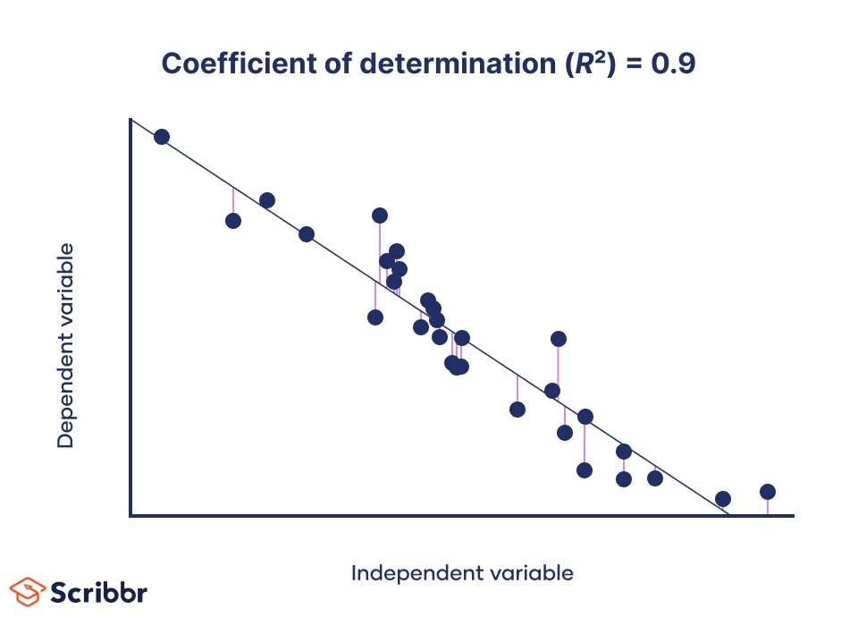

#core/artificialintelligence

- The Coefficient of Determination, denoted as R², is a descriptive regression statistic that summarises **in-sample squared-error fit relative to a mean-only baseline.** For ordinary least-squares regression with an intercept and a nonconstant outcome, the standard definition is $R^2 = 1 - \mathrm{SSE}/\mathrm{SST}$ and lies between 0 and 1. If the outcome is constant, $\mathrm{SST}=0$ and this form is undefined.

## Interpretation

- **0 R² Value:** The fitted values provide no reduction in in-sample squared error relative to predicting the observed mean.
- **1 R² Value:** The fitted values reproduce the observed outcomes exactly.

## Importance

- **Model Fit:** It summarises in-sample squared-error fit, but it is not prediction accuracy.
- **Comparison:** It can help compare [regression](../../../004_subsidiary/courses/datacamp_ml_scientist/regression.md) models on the same response and data, with attention to model complexity and validation.

## Limitations

- **Overfitting:** A high R² value does not necessarily imply that the model is good. It might overfit the data.
- **Not a Measure of Correctness:** It doesn’t indicate whether the [regression](../../../004_subsidiary/courses/datacamp_ml_scientist/regression.md) model is the correct model.
- **Not Causality:** R² does not establish that predictors cause variation in the response.
- **Sensitive to Outliers:** R² can be significantly affected by outliers in the data.
- **Range Outside the Standard Case:** The standard $1 - \mathrm{SSE}/\mathrm{SST}$ can be negative for held-out predictions, a fit worse than the mean predictor, or a no-intercept fit.

## Usage

- Commonly used in linear [regression](../../../004_subsidiary/courses/datacamp_ml_scientist/regression.md); other regression models require attention to the definition and validation scheme used.
- It is a quick descriptive summary of fit, not a measure of causal relationship strength.
