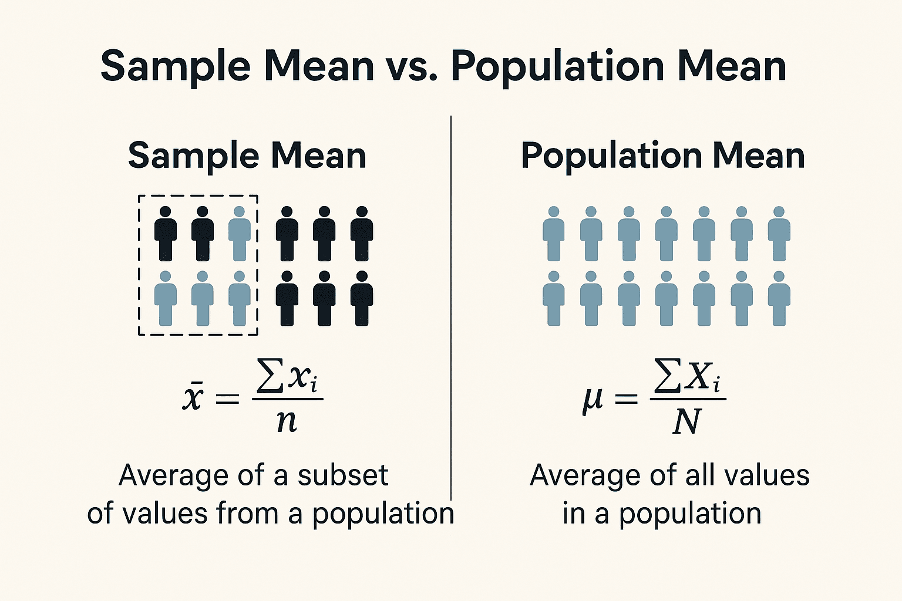

#core/artificialintelligence

In statistics, data are gathered to make inferences or assumptions about certain characteristics. Two **fundamental concepts in this process are population and sample.**

## Population

A population includes all members of a defined group that we are studying or collecting information on for data-driven decisions.

### Key Features

- A population is the entire group that you want to draw conclusions about.
- A population can be people, but it can also be animals, plants, temperatures, school grades, and so on, depending on the research question.
- The term “population” can be large or small, and it does not always refer to a population in terms of human population.

> [!example] Population vs Sample: Concrete Examples
> 
> **Population**: All 40,000 students enrolled at a university.
> **Sample**: 500 students randomly selected and surveyed about study habits.
> ---
> 
> **Population**: Every neuron in the mouse visual cortex (~2 million neurons).
> **Sample**: 150 neurons recorded during a single imaging session.
> 
> The key insight: the sample should be **representative** of the population to make valid inferences.
---

## Sample

Conversely, a sample is **a subset of the population used to represent the entire group.**

### Key Features

- A sample is a set of individuals selected from a population. It is a subset of the population and should be representative of the population.
- The purpose of a sample is to collect data that can be used to make assumptions about the larger population.
- The techniques of sampling enable the researchers to estimate population parameters from a subset of the population.
