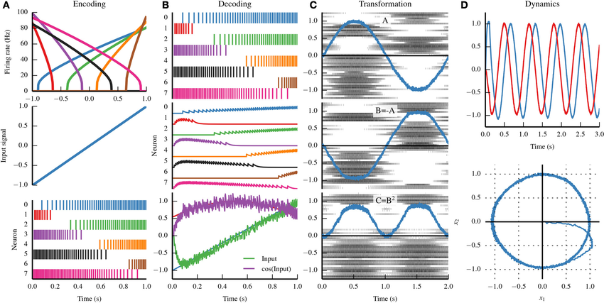

#core/artificialintelligence #core/appliedneuroscience

The Neural Engineering Framework (NEF) is a **computational framework for simulating neural systems.** It was developed to bridge the gap between neurobiological detail and the functional behaviour of neural circuits. The NEF is grounded in three core principles that dictate how populations of neurons can represent information, transform that information, and influence the dynamics of neural systems.

## Principle 1: Representation

- **Neural Coding**: NEF posits that neurons represent variables through distributed patterns of activity across populations. Each neuron in the population has a unique response or tuning curve relating a neuron’s firing rate to the represented variable.
- **Population Coding**: [Information](../../videos/integrated_information_theory.md) about a variable is not encoded in the activity of a single neuron but is distributed across a population, with each neuron contributing to a collective representation.
- **Dimensionality and Efficiency**: The framework accounts for the high-dimensional nature of neural representations and emphasises the efficiency of coding in neural populations.

## Principle 2: Transformation

- **Functional Computation**: NEF describes how neural circuits can compute mathematical functions. It suggests that synaptic weights can be determined to represent a transformation of one neural representation into another.
- **Decoding and Encoding**: Transformations involve decoding the information from the activity of presynaptic neurons and encoding it into the activity of postsynaptic neurons through synaptic connections.

## Principle 3: Dynamics

- **Temporal Representation**: NEF extends to dynamics by showing how neural circuits can embody temporal dynamics through recurrent connections.
- **State [Variables](../essential_math_for_data_science/dependent_and_independent_variables.md)**: Neural populations can represent state variables that change over time, allowing the modelling of dynamic systems and temporal processing.
- **Differential [Equations](../essential_math_for_data_science/three_strategies_for_solving_equations.md)**: The dynamics of the represented variables can be described by differential equations, which are implemented through the synaptic connections within the neural population.
