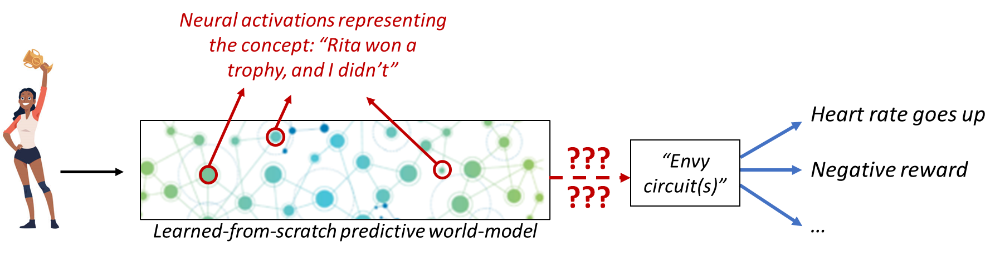

#lead/computationalphilosophy #core/artificialintelligence

The symbol grounding problem is pivotal in disciplines such as artificial intelligence, cognitive science, and philosophy of mind. It **questions how words, symbols, or concepts acquire meaning, particularly how these symbols become connected to the things or concepts they refer to in the real world.**

The figure labels neural activation patterns as representing a concept and then marks the route from that representation to action with question marks. It therefore leaves unresolved how a neural pattern becomes connected to what it is about; it does not show that neural patterns solve grounding. Stating a relation among symbols, or labelling an activation pattern as a representation, does not by itself connect a symbol to what it is about. A causal-role account, as in [functionalism](../../_general/functionalism.md), can describe how a state is used without thereby grounding it in the world.

## Key Aspects

### 1. Meaning and Reference

- **Description**: Concerns about how arbitrary symbols (e.g., the word “cat”) correspond to actual entities or concepts in the world (e.g., an actual cat).
- **Challenge**: Establishing a direct connection between symbols and world entities without relying on pre-existing definitions.

### 2. Internal vs. External

- **Description**: It deals with the correspondence between internal representations (in minds or machines) and the external world.
- **Challenge**: Ensuring representations have meaning and relevance to the external world, independently of external interpreters.

Interpreting linguistic meaning, as discussed in [deep and shallow semantic processing](deep_and_shallow_semantic_processing.md), is a different question from how a symbol becomes connected to a referent.

### 3. Infinite Regress

- **Description**: In traditional symbol systems, symbols are often defined as other symbols, leading to a potential infinite regress with no foundational meaning.
- **Challenge**: Breaking the cycle of circular definitions to provide intrinsic meaning to symbols.

[Ontology and taxonomy](../../../002_profession/bluebrain/ontology_and_taxonomy.md) and [knowledge graphs](../../../002_profession/bluebrain/knowledge_graphs.md) provide formal accounts that can record concepts and relations; recording them is not grounding them.

### 4. Embodiment and Interaction

- **Description**: Suggests that grounding occurs through a system’s interactions with the world and the embodiment of the system within the world.
- **Challenge**: Developing systems that can learn and derive meaning from their sensory experiences and interactions with the environment.

## Solutions and Approaches

Various approaches proposed to address the symbol grounding problem include:

- **Embodied Cognition**: Asserts that cognitive processes are deeply rooted in the body’s interactions with the world.
- **Situated Cognition**: Emphasises the role of the environment in shaping the nature of cognitive processes.
- **Direct Perception**: Focuses on the direct acquisition of meaning from perceptual experiences without intermediate symbol manipulation.

These are proposals, not demonstrated solutions. Semantic grounding is distinct from mere sensorimotor association: coupling a sensor to a response can yield adaptive behaviour without giving a symbol intrinsic meaning.
