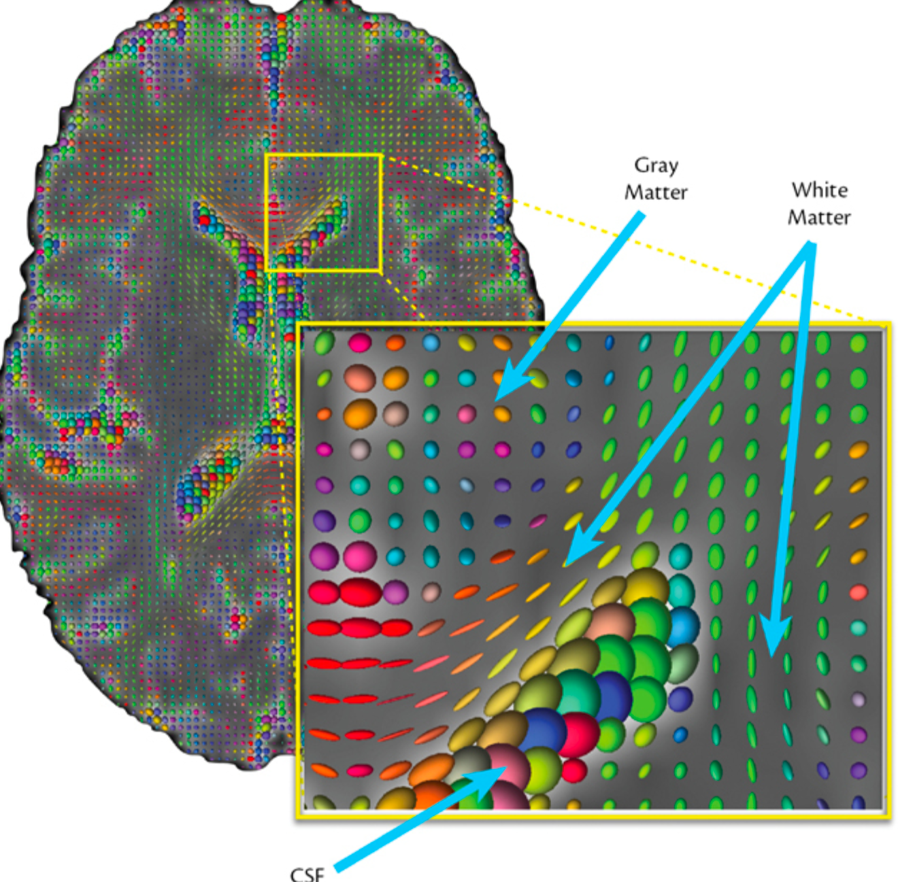

#core/appliedneuroscience

Diffusion Tensor Imaging (DTI) is a **neuroimaging technique that measures the diffusion of water molecules in brain tissue**. It provides insights into the structural organisation of brain regions, particularly white matter tracts. DTI underpins [diffusion tensor tractography](../../../003_education/kings-college/04_biological_foundations_of_mental_health/diffusion_tensor_tractography.md), which reconstructs estimated fibre orientations from diffusion directionality to map the trajectory and connectivity patterns of neural fibres by analysing water diffusion along them. Critically, tractography is inferential — it does not directly visualise axons or prove true anatomical connectivity.

## Key Concepts

DTI fits a single tensor model to each voxel, summarising diffusion as an ellipsoid defined by three eigenvalues and their eigenvectors. The standard summary metrics are derived from these tensor properties — they are **voxel-level statistical summaries, not direct tissue-specific biomarkers**.

### Fractional Anisotropy (FA)

- **Definition**: FA quantifies the degree to which water diffusion is directionally dependent, ranging from 0 (isotropic) to 1 (fully anisotropic). It does **not** directly measure fibre density or integrity.
  - **Low FA (~0)**: Represents isotropic diffusion, where water diffuses equally in all directions. Typical of cerebrospinal fluid (CSF), where structural barriers are absent.
  - **High FA (~0.6–0.8 in vivo)**: Represents anisotropic diffusion, where water preferentially diffuses along certain directions, such as parallel to white matter fibre tracts (e.g. corpus callosum, internal capsule). Values approaching 1 are the mathematical bound; typical in vivo values in major coherent tracts are well below it.
  - **Intermediate FA**: Found in grey matter, but the value varies substantially by region — cortical organisation, voxel composition, and partial volume effects all influence the observed FA.

### Axial Diffusivity (AD)

- **Definition**: Measures water diffusion along the principal eigenvector (the longest axis of the ellipsoid).
- **Significance**: AD is often used as a proxy for axonal injury in some contexts, but it does **not specifically or uniquely reflect axonal integrity**. It is also influenced by crossing fibres, oedema, inflammation, and other microstructural changes.

### Radial Diffusivity (RD)

- **Definition**: Measures water diffusion perpendicular to the principal eigenvector (the shorter axes of the ellipsoid).
- **Significance**: RD is often associated with myelin-related changes, but it does **not equal "myelin integrity"**. It is also influenced by fibre geometry and partial volume effects.

### Mean Diffusivity (MD)

- **Definition**: The average of the three tensor eigenvalues, capturing the overall magnitude of water motion regardless of direction.
- **Significance**: MD is often more sensitive than FA to increased extracellular space, oedema, tissue loss, or other processes that increase free diffusion. It is **not disease-specific** — elevated MD appears across stroke, multiple sclerosis, and neurodegeneration alike.

---

## Image Analysis

### Brain Regions

The attached image illustrates diffusion tensors in different brain regions:

1. **CSF Region**:
   - Diffusion tensors are approximately spherical, indicating isotropic diffusion (low FA).
   - Water molecules diffuse equally in all directions due to the lack of structural barriers.
2. **Grey Matter Region**:
   - Diffusion tensors vary considerably — often closer to isotropic than white matter, but with intermediate and highly variable FA depending on cortical organisation and voxel composition.
   - Water has some directional preference but far less structural constraint than in white matter.
3. **White Matter Region**:
   - Diffusion tensors are highly elongated ellipsoids, indicating anisotropic diffusion (high FA).
   - Water predominantly diffuses along [association fibres](../../../003_education/kings-college/04_biological_foundations_of_mental_health/association_fibres.md) and other coherent axonal fibre tracts.

### Diffusion Metrics

- The ellipsoids represent diffusion tensors:
  - **Shape**: Indicates the degree of anisotropy.
    - Spherical shapes = isotropic diffusion.
    - Elongated shapes = anisotropic diffusion.
  - **Size**: Reflects the magnitude of diffusivity.
- Colours represent principal diffusion directions:
  - Different colours correspond to different spatial orientations of water movement. The standard convention is red = left–right, green = anterior–posterior, blue = superior–inferior.

---

## Limitations of DTI

DTI assumes a **single tensor per voxel**, which breaks down in voxels containing **crossing, kissing, or fanning fibres**. Early estimates suggested this affected roughly one-third of white matter voxels (Behrens et al. 2007, ARD), but higher-quality reconstructions place the figure far higher: ~90% using constrained spherical deconvolution and ~63% using ARD (Jeurissen et al. 2013) — implying the tensor model is inadequate in the majority of white matter. Additional limitations include:

- **Finite spatial resolution**: voxel sizes of 2–3 mm are far larger than individual axons, so DTI metrics reflect averaged microstructure.
- **Partial volume effects**: voxels spanning tissue boundaries (e.g. grey–white junctions, white matter–CSF interfaces) produce biased metrics.
- **Motion and eddy-current artefacts**: subject motion and gradient-induced currents distort the diffusion signal.
- **Inferential nature of tractography**: fibre orientations are estimated from diffusion directionality and may diverge from true anatomical connectivity, particularly in regions with complex fibre geometry.

DTI metrics should therefore be interpreted as **voxel-level statistical summaries**, not direct histological measures.

## Modern Extensions Beyond DTI

More advanced diffusion methods address key DTI limitations by modelling more complex diffusion behaviour:

- **High Angular Resolution Diffusion Imaging (HARDI)**: samples many more gradient directions, enabling better characterisation of fibre orientations in complex white matter (e.g. crossing fibres).
- **Multi-shell Diffusion MRI**: acquires data at multiple b-values, supporting models such as **NODDI** (Neurite Orientation Dispersion and Density Imaging), which separately estimates neurite density and orientation dispersion.
- **Diffusion Kurtosis Imaging (DKI)**: extends the tensor model to capture non-Gaussian diffusion, providing sensitivity to microstructural complexity that DTI misses.
- **Constrained Spherical Deconvolution (CSD)**: estimates the fibre orientation distribution function (fODF) within each voxel, allowing probabilistic tractography through crossing-fibre regions.

## Clinical and Research Applications

DTI is widely used across neurology, psychiatry, and neurosurgery:

- **Stroke**: detects white matter abnormalities that may be occult on conventional MRI, particularly in hyperacute and chronic phases.
- **Traumatic Brain Injury (TBI)**: reveals diffuse axonal injury and microstructural damage even when CT and conventional MRI appear normal.
- **Multiple Sclerosis**: quantifies demyelination and axonal loss in lesions and normal-appearing white matter.
- **Pre-surgical Planning**: estimates the spatial relationship between lesions (e.g. tumours, AVMs) and major white matter tracts to guide resection and preserve function.
- **Connectomics**: builds structural network models from tractography-derived connectivity, supporting graph-theoretical analyses of brain network organisation.