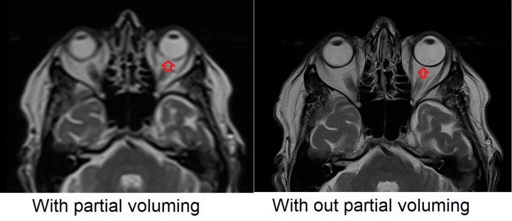

#core/appliedneuroscience

The **partial volume effect (PVE)** occurs when a single MRI voxel contains multiple tissue types, leading to signal averaging. It is common at tissue boundaries (e.g., grey/white matter) or in small structures.

## Causes and Mechanism

- **Voxel Size**: Larger voxels increase PVE due to signal mixing.
- **RF Pulse Imperfections**: Excitation of tissues outside the desired slice (cross-talk).
- **Mathematical Model**:  
  $$ S_V = f_A S_A + f_B S_B $$  
  _SV_ = voxel signal, _f_ = fractional tissue volume, _S_ = tissue signal.

## Impact

1. **Quantitative Errors**:
   1. 20–60% errors in brain structure volume measurements if ignored (González Ballester et al.).
   2. Distorts [diffusion tensor imaging](diffusion_tensor_imaging.md) (DTI) metrics.
2. **Clinical Implications**:
   1. Reduces accuracy in cortical thickness analysis.
   2. Skews functional MRI/resting-state connectivity studies.

## Key Terms

- **Voxel**: 3D pixel; smaller size reduces PVE.
- **Cross-Talk**: Signal interference from adjacent slices.
- **Full Width at Half Maximum (FWHM)**: Resolution rule of thumb — objects <2× FWHM are underestimated.

> [!info] Takeaway
> PVE is unavoidable but manageable via high-resolution imaging and advanced PVC algorithms. Critical for neuroimaging and quantitative studies.

> [!example]
> 5-mm slices blend nerve/CSF signals, while 1-mm slices show distinct boundaries.
