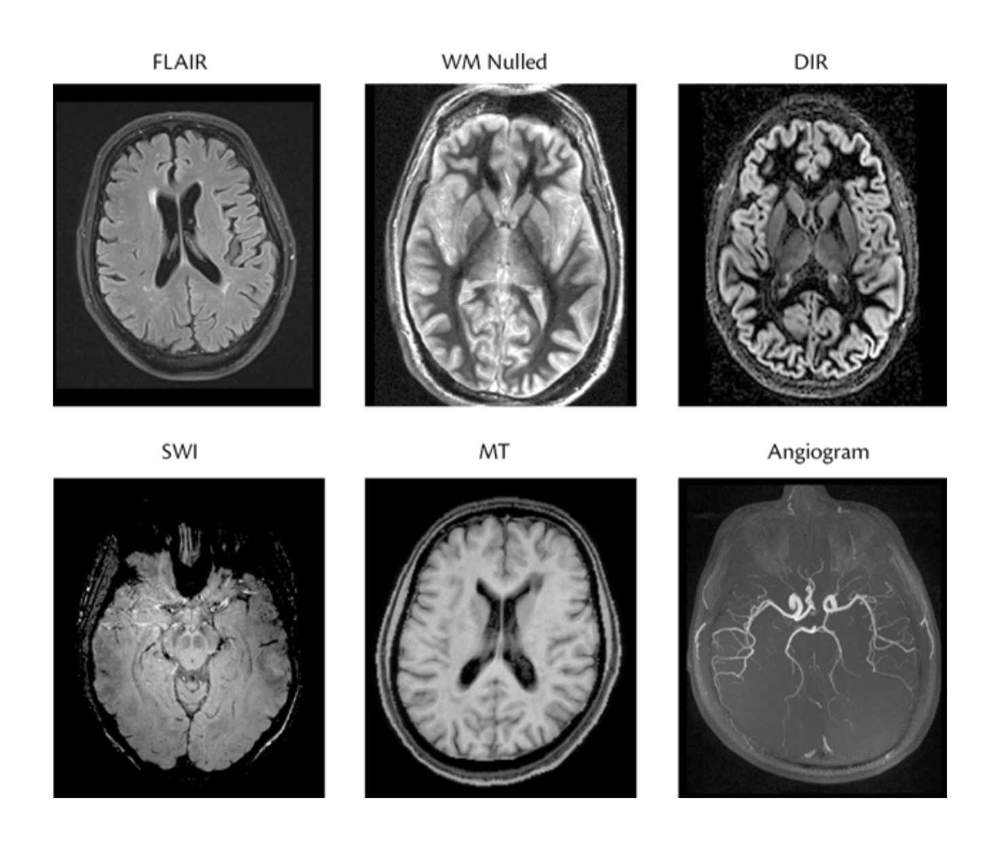

#core/appliedneuroscience

Structural MRI modalities are specialised acquisition sequences — FLAIR, DIR, SWI, MT, and MRA — that enhance contrast for specific tissue types or pathologies beyond standard T1/T2 imaging.

## FLAIR (Fluid-Attenuated Inversion Recovery)

- **Usage**: Commonly used in brain imaging to detect periventricular hyperintense lesions, such as multiple sclerosis plaques. It suppresses cerebrospinal fluid (CSF) signals to enhance lesion visibility.
- **Mechanism**: Uses an inversion recovery pulse sequence with a carefully chosen inversion time (TI). This suppresses the signal from fluids like CSF by nulling their magnetisation during imaging, improving contrast between brain tissue and CSF.

## DIR (Double Inversion Recovery)

- **Usage**: Provides high contrast resolution between grey matter (GM) and white matter (WM), where [partial volume effects](partial_volume_effect_in_mri.md) blur tissue boundaries. It is particularly useful for detecting cortical and subcortical lesions in [central nervous system](../../../003_education/kcl/04_biological_foundations_of_mental_health/central_nervous_system.md) diseases.
- **Mechanism**: Applies two 180° inversion radio-frequency pulses to suppress two tissue types simultaneously (e.g., WM and CSF or GM and CSF). This selective suppression enhances the conspicuity of specific tissue types.

## SWI (Susceptibility-Weighted Imaging)

- **Usage**: Sensitive to paramagnetic substances like deoxygenated blood and intracranial mineral deposits. Used for diagnosing venous abnormalities, intracranial haemorrhage, traumatic brain injury, stroke, neoplasms, and multiple sclerosis.
- **Mechanism**: Combines magnitude and phase data from gradient echo sequences to enhance contrast based on differences in magnetic susceptibility. SWI highlights venous structures and mineral deposits through minimum intensity projections.

## MT (Magnetisation Transfer Imaging)

- **Usage**: Detects subtle changes in brain tissues not visible with standard MRI techniques. Used for measuring magnetisation transfer ratios (MTR), which reflect macromolecular-bound protons and free water compartments. Commonly applied in neurodegenerative disease research.
- **Mechanism**: Exploits interactions between free protons (mobile water) and bound protons (macromolecules). Bound protons are normally invisible in MR imaging but can be indirectly measured via their effect on free proton signals.

## MRA (Magnetic Resonance Angiography)

- **Usage**: Non-invasive depiction of blood vessels for assessing vascular anatomy and abnormalities such as stenosis or aneurysms. MRA does not use ionising radiation, and some MRA techniques can be performed without contrast. CT angiography (CTA) is generally faster, provides higher spatial resolution, and is less sensitive to motion during acquisition; it uses ionising radiation and, when contrast is used, typically uses iodinated contrast. These are contextual trade-offs rather than a universal preference for one modality. Modality choice depends on the vascular territory, urgency, required spatial resolution, flow characteristics, contrast requirements, motion, and contraindications ([ACR Cerebrovascular Disease](https://acsearch.acr.org/docs/69478/Narrative)).
- **Mechanism**:
  - **TOF (Time-of-Flight)**: Inflow-related enhancement occurs when relatively unsaturated blood enters an RF-excited slab and replaces saturated spins. The mechanism is not intrinsically tied to systole, although pulsatile flow can affect the signal ([Wheaton & Miyazaki, 2012](https://doi.org/10.1002/jmri.23641)).
  - **Phase contrast**: Bipolar gradient pairs encode velocity-dependent phase shifts, allowing flow direction and velocity-related information to be represented ([Wheaton & Miyazaki, 2012](https://doi.org/10.1002/jmri.23641)).
  - **CE-MRA (contrast-enhanced MRA)**: A gadolinium-based contrast agent shortens blood T1, increasing its signal in a T1-weighted acquisition; timing the acquisition to arterial passage supports arterial depiction ([Edelman et al., 2022](https://doi.org/10.1148/rg.2021210141)).
  - **QISS (Quiescent-Interval Slice-Selective)**: A specialised synchronised noncontrast technique that uses cardiac timing, saturation, and inflow preparation; it is not a general description of all MRA methods ([Wheaton & Miyazaki, 2012](https://doi.org/10.1002/jmri.23641)).

## Sources

- [ACR Cerebrovascular Disease](https://acsearch.acr.org/docs/69478/Narrative)
- [Wheaton & Miyazaki (2012)](https://doi.org/10.1002/jmri.23641)
- [Edelman et al. (2022)](https://doi.org/10.1148/rg.2021210141)
