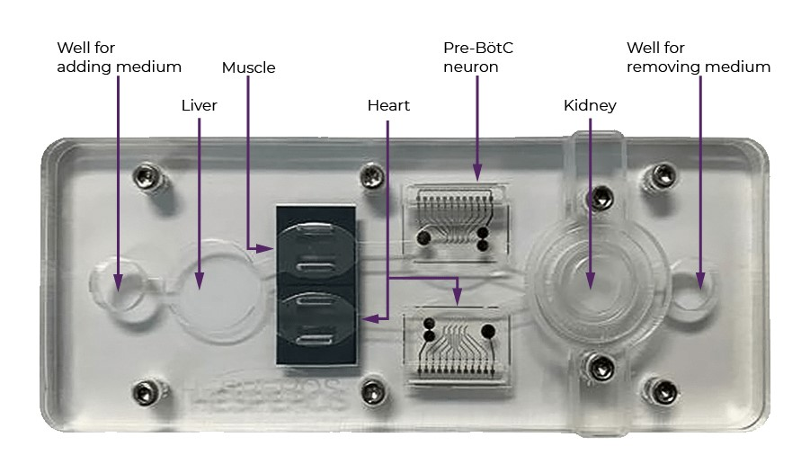

#lead/experimentalmedicine #core/appliedneuroscience

Human-on-a-chip systems are experimental **microfluidic models that combine several miniature organ models to approximate selected physiological interactions under controlled conditions.** By connecting organ-specific cell cultures with channels that mimic blood flow, these platforms allow researchers to generate experimental data about drug effects, disease processes, and toxicity. They do not reproduce complete human physiology and are not substitutes for animal studies or later clinical evidence.

Constructing a chip is distinct from validating it: chip data can contribute possible bounded preclinical evidence, while correlation with clinical outcomes remains unresolved. [Bioprinting](../../../003_education/kcl/05_neuroscience_in_society/bioprinting.md) may fabricate structures used in engineered models, but it does not replace controlled microfluidic experimentation. Within the [IDEAL framework](../../../002_profession/eightsix/ideal_framework.md), such data can inform preclinical preparation and evidence generation rather than replace justified animal studies, first-in-human evaluation, comparative assessment, or long-term surveillance.

## Key Features

- **Microfluidic channels:** Mimic blood flow between organ compartments.
- **Organ mimics:** Use human cells (e.g., liver, lung, kidney, heart).
- **Mechanical forces:** Simulate breathing, heartbeat, peristalsis, etc.

## Main Functions

- **Multi-organ pharmacokinetics:** Study drug metabolism and effects across organs.
- **Disease modelling:** Model selected aspects of human diseases and infections.
- **Toxicity screening:** Detect harmful drug effects on multiple organs.

## Applications

- **Drug development:** Investigate potential human drug responses (e.g., Emulate Bio, Roche).
- **Personalised medicine:** Explore patient-specific drug reactions.
- **Defence research:** Study effects of toxins/radiation (e.g., DARPA projects).

## Challenges

- **Universal culture media:** Needed for supporting different cell types.
- **Integration:** Linking more organs for full-body simulation.
- **Validation:** Correlating chip data with real clinical outcomes.
