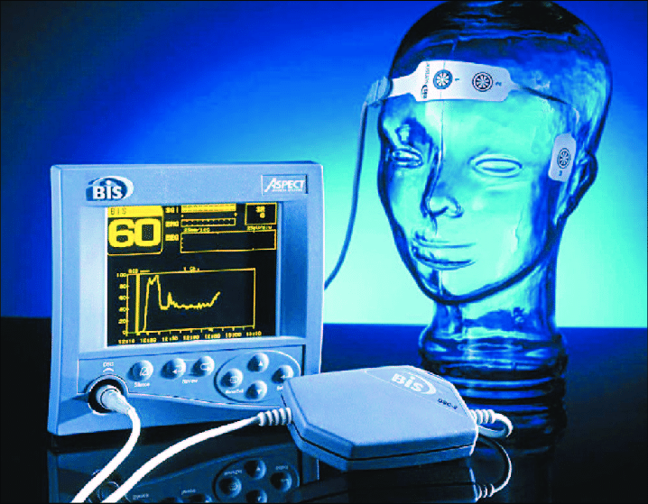

#core/appliedneuroscience

The bispectral index (BIS) is a **processed EEG parameter** used to monitor the **depth of anaesthesia during surgery.** It ranges from 0 to 100, with lower values indicating deeper anaesthesia.

## Key Points

- BIS is derived from EEG signals using power spectral analysis
- BIS between 40-60 is considered appropriate for general anaesthesia
- BIS monitoring helps guide anaesthetic administration and avoid complications
- The utility and reliability of BIS monitoring is still debated

BIS is commonly used to monitor anaesthetic depth with the goal of optimising anaesthetic management. However, its role in improving patient outcomes is still an area of active research and discussion.
