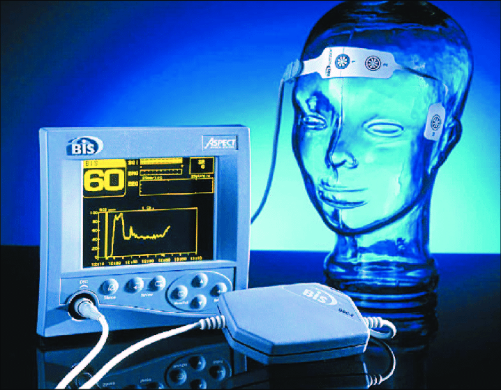

#core/theoreticalneurosurgery #core/appliedneuroscience

The **bispectral index (BIS)** is a proprietary, processed frontal-EEG metric that compresses the electrical state of the cortex into a single dimensionless number from 0 to 100, used to monitor the **depth of anaesthesia during surgery**. Zero corresponds to an isoelectric (silent) EEG and 100 to a fully awake cortex; the target range for general anaesthesia is 40–60.

## How the Algorithm Works

BIS is computed from a **single frontal EEG channel** via a forehead sensor. The algorithm itself is proprietary, but its four published subparameters are:

- **Burst Suppression Ratio (BSR)** — fraction of time the EEG spends in burst suppression (alternating high-amplitude bursts and near-isoelectric periods); high BSR drives BIS below ~20.
- **QUAZI Suppression Index** — a proprietary metric detecting low-voltage, quasi-isoelectric segments that the classic BSR misses.
- **Relative Beta Ratio** — compares power in high-frequency (beta) bands against lower frequencies; beta dominance pushes BIS toward the awake range.
- **SyncFastSlow** — the eponymous **bispectral (phase-coupling) measure**, quantifying synchronisation between fast and slow EEG components; coupling patterns shift systematically with hypnotic depth.

These subparameters are combined through multiple regression equations whose weights switch with the estimated anaesthetic state. The first algorithm (~1992) was trained to predict movement at surgical incision; the widely used version 4.1 dates from 2004.

The EEG signal itself originates from synchronised [postsynaptic potentials](../../../003_education/kcl/01_techniques_in_neuroscience/types_of_biological_electrical_activity.md) of cortical pyramidal neurons, recorded at the scalp as a population-level [field potential](../../../003_education/kcl/01_techniques_in_neuroscience/field_potential.md).

## The 0–100 Scale

| BIS range | Clinical state |
| --------- | -------------- |
| 90–100 | Awake, normal cortical activity |
| 60–80 | Sedation (light to moderate) |
| 40–60 | **General anaesthesia — surgical target range** |
| <40 | Deep hypnotic state, rising burst suppression |
| 0–20 | Burst suppression approaching isoelectric EEG; 0 = electrical silence |

## History and Variants

- Developed by **Aspect Medical Systems**; commercial launch **1994**.
- **FDA cleared in 1996** — the first processed-EEG monitor of hypnotic drug effects.
- Aspect was acquired by **Covidien in 2009**; BIS is now marketed by **Medtronic**.
- **BIS Quatro**: the standard four-electrode disposable forehead sensor feeding the algorithm.

## Clinical Evidence: The Awareness Debate

Intraoperative **awareness with recall** — waking paralysed during surgery — is the failure mode BIS was built to prevent:

| Trial | Design | Result |
| ----- | ------ | ------ |
| **B-Aware** (Myles et al., Lancet 2004; 2,463 high-risk patients) | BIS-guided (40–60) vs routine care | Definite awareness 2/1225 (0.17%) vs 11/1238 (0.89%); **82% relative risk reduction**, NNT ≈ 138 |
| **B-Unaware** (Avidan et al., NEJM 2008; 1,941 patients) | BIS vs end-tidal anaesthetic concentration (ETAC) protocol | 2 vs 2 definite awareness — **no benefit** over ETAC |
| **BAG-RECALL** (Avidan et al., NEJM 2011; >6,000 patients) | BIS vs ETAC, multicentre | No benefit; numerically *more* awareness in the BIS arm (not significant) |

The consensus reading: BIS **reduces awareness compared with unstructured clinical-sign monitoring**, but offers **no advantage over an ETAC/MAC protocol**. Selective use — total intravenous anaesthesia (TIVA) where no end-tidal feedback exists, and high-risk cases — remains reasonable.

## Limitations and Artefacts

BIS is calibrated on GABAergic hypnotics; agents and physiology outside that mould decouple the number from actual depth:

| Confounder | BIS behaviour | Practical consequence |
| ---------- | ------------- | --------------------- |
| **Ketamine** | Falsely **high** (dissociative, high-frequency EEG activation) | Underestimates depth; unreliable as sole guide |
| **Nitrous oxide** | Minimal fall despite MAC-sparing hypnosis | Underestimates depth when N₂O is a major component |
| **Dexmedetomidine** | Falsely **low** (<40 while still arousable) | Overestimates depth; risk of under-dosing if titrated to BIS alone |
| **Frontalis EMG** | Spuriously **high** (muscle artefact read as cortical activation) | Light paralysis can mimic light anaesthesia |
| **Electrocautery, poor electrode contact** | Erratic jumps or dropouts | Must be read alongside the raw EEG |
| **Hypothermia, hypotension, hypoglycaemia** | Globally depressed EEG | Depth overestimated for non-pharmacological reasons |

> [!warning] Read the patient, not the number
> BIS is a processed, proprietary index. Standard practice is to interpret it in context — drug regimen, EMG bar, raw EEG waveform — rather than as an absolute measure of consciousness.

## Long-Term Outcomes

Follow-up of the B-Aware cohort (Leslie et al., Anesthesia & Analgesia 2010; median 3.5 years) found:

- **No significant mortality benefit** from BIS monitoring itself (HR 0.86, p = 0.07).
- Sustained **BIS <40 for more than 5 minutes** was associated with **higher mortality** (HR 1.41) — an association rather than established causation, but a recurrent signal that excessively deep anaesthesia carries risk.

## Relevance to Consciousness Measurement

BIS is the most clinically deployed member of the [quantitative consciousness index](../../papers/quantitative_consciousness_index.md) family — objective, EEG-derived alternatives to observational scales (that note also covers the rival Patient State Index). Three connections matter for consciousness science:

- **Awareness under neuromuscular blockade is an [island of awareness](island_of_awareness.md) scenario**: consciousness potentially present with zero motor output, undetectable behaviourally. BIS is a neural marker attempting to detect exactly this — and the B-Unaware and BAG-RECALL results show awareness can still occur within the target range, marking the limits of frontal-EEG proxies.
- The same processed-EEG logic extends from the operating theatre to disorders of consciousness such as [apallic syndrome](apallic_syndrome.md) (vegetative state), where EEG-based assessment supplements absent behavioural responses.
- Its drug-specific failures are themselves informative: ketamine can abolish behavioural responsiveness while leaving BIS high, showing that the index tracks *cortical rhythms typical of GABAergic drugs* rather than consciousness per se.

> [!tip] Why this note lives here
> BIS is the only widely deployed, real-time, EEG-based consciousness meter in routine clinical use. Both its successes and its partial failures are data about what scalp EEG can — and cannot — tell us about subjective experience.
