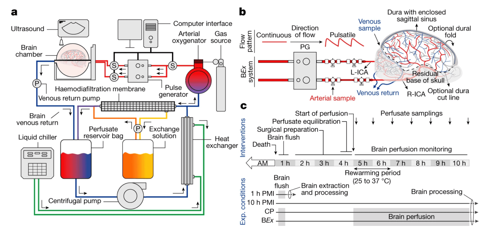

#core/appliedneuroscience #core/artificialintelligence

An ex cranio brain is **a brain that has been removed from the body.** It is used in scientific research to describe situations where brain activity supports consciousness even when fully isolated from the body and its environment.

BrainEx System Architecture
- **Brain chamber**: sealed container for the isolated organ
- **Pulse generator + centrifugal pump**: replicates heartbeat-driven flow
 - **Arterial oxygenator + heat exchanger**: maintains physiological O₂ and temperature
- **Haemodiafiltration membrane**: continuously filters the perfusate
- Arterial access via **left and right internal carotid arteries (L-ICA / R-ICA)**,
	- dura intact with enclosed sagittal sinus

> [!question] Does Disembodiment Break Consciousness?
> Ex cranio preparations challenge **embodied cognition** theories — if synaptic activity can be sustained without sensory input, motor output, or interoceptive feedback, what remains of the conditions thought necessary for experience? This is a live question for [consciousness engineering](../../_general/consciousness_engineering.md) and for frameworks like Global Workspace Theory or [Integrated Information Theory](../../videos/integrated_information_theory.md).