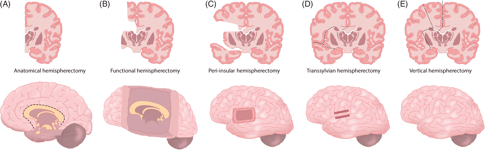

#core/theoreticalneurosurgery #core/appliedneuroscience

Hemispheric surgery is used to treat carefully selected patients with severe, drug-resistant epilepsy arising predominantly from one cerebral hemisphere. The terms describe related but distinct operations: anatomical hemispherectomy removes much of the affected hemisphere; functional hemispherectomy removes a more limited amount of tissue while extensively disconnecting the remainder; and hemispherotomy principally disconnects the affected hemisphere while sparing more tissue. The terminology is not always used identically between centres, so the operative details matter. [1]

## Indications

Reported indications include unilateral, drug-resistant epilepsy associated with conditions such as:

- Rasmussen’s encephalitis
- Sturge-Weber syndrome
- Hemimegalencephaly
- Extensive cortical dysplasia
- Post-traumatic epilepsy
- Perinatal stroke leading to extensive unilateral brain damage

## Procedure

The goal of a hemispherotomy is to interrupt the pathways by which seizures propagate from the affected hemisphere. The exact disconnections vary by technique, but the procedure generally involves:

1. **Surgical Access**: A [craniotomy](../the_feeling_of_life_itself/craniotomy.md) is performed to access the affected hemisphere.
2. **Disconnection**: Relevant commissural and intrahemispheric pathways, including the [corpus callosum](../../../003_education/kcl/05_neuroscience_in_society/corpus_callosum.md), are disconnected according to the chosen approach. Unlike anatomical hemispherectomy, little tissue is removed.
3. **Preservation**: Where possible, brain tissue is preserved to minimise the impact on cognitive and motor functions.

## Outcomes

Seizure control can be substantial in appropriately selected patients, but outcomes vary. They depend on age at surgery, the underlying pathology, pre-existing damage, the laterality and extent of the affected network, and rehabilitation. Substantial functions can remain, but residual or exacerbated deficits are common, particularly in:

- Motor control, leading to hemiparesis on the side opposite the surgery
- Sensory functions, including vision, touch, and [proprioception](../../../004_subsidiary/courses/udemy/neuroanatomy/proprioception.md)
- Language and cognitive functions, depending on the hemisphere involved and the age of the patient

The possibility of functional reorganisation does not imply complete recovery or the absence of impairment. [1][2]

## Rehabilitation

Post-surgical rehabilitation is crucial for maximising recovery and adaptation. This may include:

- Physical therapy to improve motor function and mobility
- Occupational therapy for daily living skills
- Speech therapy, especially for left hemispherotomy in language-dominant individuals
- Cognitive rehabilitation to support learning and memory

## Implications for Consciousness

These operations provide cautious evidence for biological functional reorganisation and resilience: a person can retain substantial abilities despite major unilateral pathology and surgical disconnection. They also show that some functions do not require every part of the normally connected brain. This is an inference about biological recovery and incomplete brain necessity, not evidence that:

- synthetic substrate replacement or arbitrary material substrate-independence;
- unchanged phenomenal experience or personal identity; or
- progressive transfer of a mind from one substrate to another.

The clinical outcomes therefore support only a limited biological analogy or motivation for questions about functional organisation; they are not direct evidence for those stronger claims.

## Surgical Variants

The embedded diagram illustrates five approaches with varying degrees of tissue removal vs. disconnection:

| Approach                    | Method                                      | Tissue removed                         |
| --------------------------- | ------------------------------------------- | --------------------------------------- |
| Anatomical hemispherectomy  | Removal of much of the affected hemisphere  | Extensive                               |
| Functional hemispherectomy  | Limited removal + extensive disconnection  | More limited                            |
| Peri-insular hemispherotomy | Disconnection around the insula             | Minimal                                 |
| Transsylvian hemispherotomy | Disconnection via the Sylvian fissure       | Minimal                                 |
| Vertical hemispherotomy     | Superior disconnection approach              | Minimal                                 |

Hemispherotomy generally aims to achieve the necessary disconnection with less tissue removal than anatomical hemispherectomy; the balance between seizure control and complications remains patient- and technique-dependent. [1]

## Sources

- [Lew, “Hemispherectomy in the treatment of seizures: a review”](https://doi.org/10.3978/j.issn.2224-4336.2014.04.01) ([full text](https://pmc.ncbi.nlm.nih.gov/articles/PMC4729844/)) [1]
- [Vining et al., paediatric hemispherectomy study](https://doi.org/10.1542/peds.100.2.163) [2]
