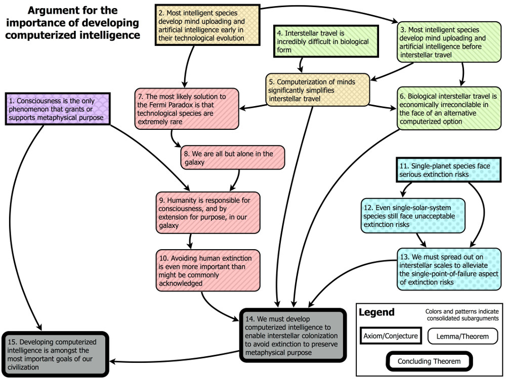

#core/artificialintelligence

Developing computerised intelligence is **essential for addressing existential risks, extending human cognitive capacities, and enabling mind uploading as a form of personal continuity.** The argument rests on both practical and philosophical grounds: biological intelligence is fragile, resource-limited, and confined to a single substrate.

## Existential Risk Mitigation

Computerised intelligence offers:

- **Redundancy**: Unlike biological brains, digital systems can be backed up, distributed, and recovered from catastrophic failure
- **Speed**: Electronic processing enables faster response to time-critical threats
- **Scalability**: Cognitive resources can expand beyond biological constraints

See [PSNST](../../_general/psnst.md) for substrate-independent approaches to neural persistence.

## Enabling Mind Uploading

The development of computerised intelligence is a prerequisite for [mind uploading](mind-uploading_approaches.md):

1. **Substrate independence**: Demonstrating that cognition can occur in non-biological media
2. **Simulation fidelity**: Achieving sufficient detail to preserve psychological continuity
3. **Verification methods**: Establishing criteria for successful upload (see [Fading qualia](../from_biological_to_artificial_consciousness/fading_qualia.md))

## Philosophical Implications

Questions around [Existential altruism](../../papers/existential_altruism.md) arise: if uploaded minds represent continuity of pattern rather than experiential continuity, what obligations do we have toward their development? The [Symbol grounding problem](../how_to_build_a_brain/symbol_grounding_problem.md) also applies—can computerised systems ground meaning in the same way biological minds do?