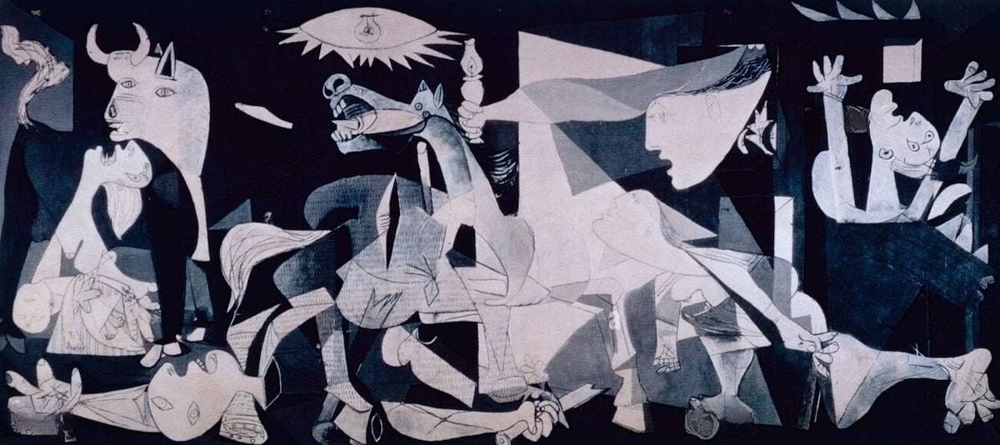

#fundamental/logic

Magnum opus, a Latin phrase translating to "great work," primarily **denotes the most significant, ambitious, or masterful creation** of an artist, writer, composer, or other creator, often regarded as their crowning achievement and legacy.

## Key Concepts

- **Etymology**: From Latin "magnum" (great) and "opus" (work), entering English in the 18th century to describe exceptional artistic endeavours.
- **Artistic Usage**: Represents a creator's pinnacle, embodying their skill, vision, and innovation; plural form is "magna opera."
- **Synonyms**: Masterpiece, chef-d'œuvre, monumental work; antonyms include minor or lesser works.

## Examples

- **Art**: Leonardo da Vinci's _Mona Lisa_ or Picasso's _Guernica_.
- **Science**: Einstein's theory of _General Relativity_.
- **Literature**: Marcel Proust's _Remembrance of Things Past_.
- **Film**: Raj Kapoor's _Mera Naam Joker_ as a personal magnum opus.

> [!note] Insight on Legacy
> A magnum opus often defines a creator's enduring impact, transcending time as a benchmark of excellence, though it may not always be their most commercially successful work.
