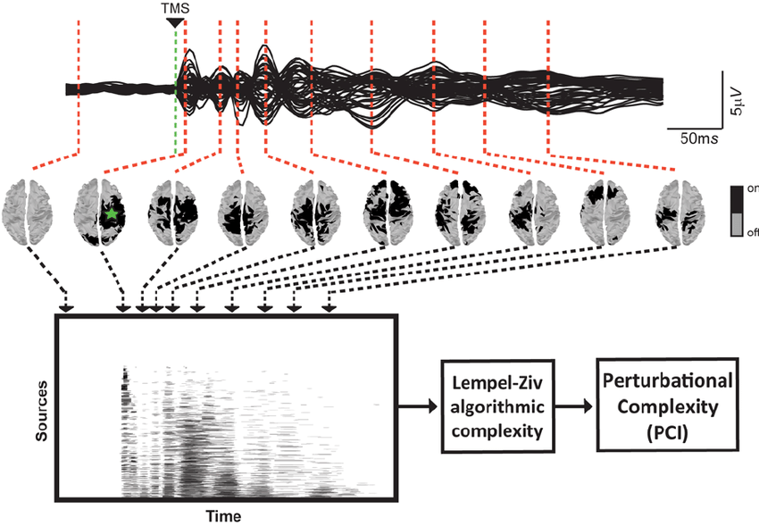

#core/appliedneuroscience

The **neural correlate of consciousness** (NCC) refers to the minimal neuronal mechanisms jointly sufficient for any one specific conscious experience. The concept was formalised by Christof Koch and Francis Crick in the 1990s as a tractable empirical target for consciousness research.

## Definitions

Koch distinguishes three related concepts:

1. **Content-specific NCC**: Neural correlates of specific conscious contents (e.g., perceiving a face vs a house)
2. **Full NCC**: Neural correlates of consciousness itself—the capacity for any experience
3. **Neural prerequisites**: Necessary but not sufficient conditions (e.g., arousal, attention, working memory)

This taxonomy matters because different brain regions may serve different roles: the thalamus as prerequisite (enabling), posterior cortex as content-specific NCC, and prefrontal involvement debated.

## Candidate Brain Regions

| Region                                               | Theory Supporting                                                                                                                       | Key Evidence                                               |
| ---------------------------------------------------- | --------------------------------------------------------------------------------------------------------------------------------------- | ---------------------------------------------------------- |
| **Posterior "hot zone"** (temporo-parieto-occipital) | [Integrated information theory](../../videos/integrated_information_theory.md)                                                          | IIT's posterior-cortex prediction, PCI associations, content-specific activity |
| **Prefrontal cortex**                                | Global Workspace Theory, [Higher-order theories of consciousness](../sizing_up_consciousness/higher-order_theories_of_consciousness.md) | Late "ignition" events, P3b component, metacognition       |
| **Early visual cortex (V1)**                         | Recurrent Processing Theory                                                                                                             | Local recurrent loops correlate with visual awareness      |
| **Thalamocortical system**                           | Multiple theories                                                                                                                       | Thalamic awareness potential, gating function              |
| **Claustrum**                                        | Koch's hypothesis                                                                                                                       | Dense connectivity, potential integration hub              |

## Competing Theories

### [Integrated Information Theory](../../videos/integrated_information_theory.md) (IIT)

IIT proposes that the NCC is associated with a posterior cortex where integrated information (Φ) would be maximal. Within IIT's theory, consciousness _is_ integrated information: physical systems are conscious to the degree they integrate information irreducibly. This is a theoretical claim, not an empirical finding that PCI or standard EEG has measured Φ.

- **Prediction**: Posterior "hot zone" is the NCC; prefrontal cortex not required
- **Empirical proxy**: [Perturbational Complexity Index](../../papers/quantitative_consciousness_index.md) (PCI), which is not a measurement of Φ
- **Key researcher**: Giulio Tononi
- See: [Integrated information theory](../../videos/integrated_information_theory.md), [Shannon information](shannon_information.md)

### Global Neuronal Workspace Theory (GNWT)

Consciousness arises when information gains access to a "global workspace" and is broadcast widely across prefrontal-parietal networks. Unconscious processing remains local.

- **Prediction**: Prefrontal cortex necessary; late "ignition" events (~300ms) as NCC signature
- **Measure**: P3b ERP component, frontoparietal connectivity
- **Key researchers**: Stanislas Dehaene, Bernard Baars

### Higher-Order Theories (HOT)

A mental state becomes conscious when represented by a higher-order state (thought or perception about that state). Consciousness requires metacognitive monitoring.

- **Prediction**: Prefrontal cortex necessary for higher-order representations
- **Measure**: Metacognitive confidence signals, dorsolateral PFC activity
- **Key researcher**: David Rosenthal
- See: [Higher-order theories of consciousness](../sizing_up_consciousness/higher-order_theories_of_consciousness.md)

### Recurrent Processing Theory (RPT)

Phenomenal consciousness arises from recurrent (feedback) processing within sensory cortices, distinct from later reflective consciousness requiring frontal involvement.

- **Prediction**: V1 can support phenomenal consciousness through local recurrent loops; PFC not required
- **Measure**: Visual Awareness Negativity (VAN) ~200ms post-stimulus
- **Key researcher**: Victor Lamme

### Predictive Processing

Consciousness emerges from hierarchical predictive models minimising prediction error. No single "consciousness centre"—distributed across the predictive hierarchy.

- **Prediction**: Precision-weighted prediction errors as consciousness markers
- **Key researcher**: Anil Seth (consciousness as "controlled hallucination")

## Empirical Approaches

### Perturbational Complexity Index (PCI)

The "zap-and-zip" method developed by Giulio Tononi is motivated by the idea that consciousness requires both **integration** (distributed interactions) and **differentiation** (information-rich patterns), but it does not instantiate IIT's causal formalism or compute Φ:

1. **Zap**: TMS pulse to cortex creates direct perturbation
2. **Record**: High-density EEG captures the spatiotemporal response
3. **Binarise**: Statistical thresholding creates binary activation matrix
4. **Zip**: Lempel-Ziv compression quantifies algorithmic complexity
5. **Interpret**: In the original study, a PCI* threshold around 0.31 separated the studied conscious and unconscious conditions; it is not a universal consciousness boundary.

**Clinical validation**:

- Casali et al. (2013) reported 100% separation of the studied conscious and unconscious states ([source](https://doi.org/10.1126/scitranslmed.3006294))
- Reported detection of covert consciousness in behaviourally unresponsive patients
- Ketamine finding: high PCI despite unresponsiveness, providing evidence that responsiveness and PCI can dissociate; this does not by itself prove phenomenal consciousness

**Limitations**:

- Does not itself instantiate IIT's causal formalism or compute Φ
- Measures integration-differentiation without specifying critical brain regions
- Requires expensive TMS-EEG equipment
- Does not establish phenomenal consciousness, personal identity, or continuity, and does not directly measure Φ

See: [Quantitative consciousness index](../../papers/quantitative_consciousness_index.md)

### No-Report Paradigms

Attempt to study NCC without behavioural reports (avoiding the confound between consciousness and reportability). Methods include:

- Optokinetic nystagmus (OKN) as objective perceptual measure
- Pupillometry
- Inattentional blindness paradigms
- Passive viewing with delayed reports

**Critique**: May study "neural correlates of conscious disengagement" rather than NCC proper—without tasks, the conscious mind may disengage (daydreaming, mind-wandering).

### Intracranial Recordings

Direct brain recordings in epilepsy patients provide high spatiotemporal resolution:

- High gamma activity (HGA) in occipitotemporal cortex >200ms post-stimulus correlates with visual consciousness
- Early responses (<200ms) occur regardless of conscious perception
- Thalamic awareness potential distinguishes seen vs unseen stimuli

## Adversarial Collaboration Results (2025)

The COGITATE consortium conducted a large-scale adversarial collaboration testing IIT and GNWT predictions in 2025 (n = 256; [Nature source](https://www.nature.com/articles/s41586-025-08888-1)) using fMRI, MEG, and intracranial EEG:

**Key findings**:

- Conscious content represented in visual cortex, ventrotemporal cortex, AND inferior frontal cortex
- Sustained responses in occipital and lateral temporal cortex reflect stimulus duration
- Content-specific synchronisation between frontal and early visual areas

**Challenges to IIT**:

- No sustained posterior synchronisation of the kind predicted by the tested IIT account; this challenges that prediction rather than establishing a generic failure of posterior connectivity

**Challenges to GNWT**:

- Limited representation of certain conscious dimensions in prefrontal cortex
- General lack of "ignition" at stimulus offset

**Implication**: The results challenged key predictions of both IIT and GNWT, but did not settle which theory is correct. Different theories may still capture different aspects of consciousness, and further work is needed.

## Relation to [Consciousness Engineering](../../_general/consciousness_engineering.md)

For [Progressive Synthetic Neural Substrate Transfer](../../_general/psnst.md), NCC-related measures could provide real-time, indirect monitoring signals during gradual substrate replacement:

- [PCI](../../papers/quantitative_consciousness_index.md) for a state-related perturbational-complexity proxy, not proof of phenomenal consciousness or continuity
- [IIT's Φ](../../videos/integrated_information_theory.md) as a theoretical causal/intrinsic quantity, not a standard EEG-derived metric
- [Naturalisation of phenomenology](../../articles/naturalisation_of_phenomenology.md) for first-person verification

The key philosophical question is whether preserving NCC-related mechanisms during substrate transfer would preserve [phenomenal consciousness](../../videos/access_and_phenomenal_consciousness.md). These empirical proxies do not settle that question. This connects to [Chalmers' organisational invariance](../from_biological_to_artificial_consciousness/fading_qualia.md) and [the hard problem](../../_general/philosophical_zombies.md).

## Key Researchers

| Researcher            | Key Contributions                                                                      |
| --------------------- | -------------------------------------------------------------------------------------- |
| **Christof Koch**     | NCC formalisation, claustrum hypothesis, IIT collaboration                             |
| **Giulio Tononi**     | [Integrated Information Theory](../../videos/integrated_information_theory.md), Φ, PCI |
| **Stanislas Dehaene** | Global Neuronal Workspace Theory, P3b                                                  |
| **Anil Seth**         | Predictive processing, "controlled hallucination"                                      |
| **Victor Lamme**      | Recurrent Processing Theory, VAN                                                       |
| **Lucia Melloni**     | Adversarial collaborations, COGITATE consortium                                        |
| **Melanie Boly**      | Disorders of consciousness, PCI validation                                             |
