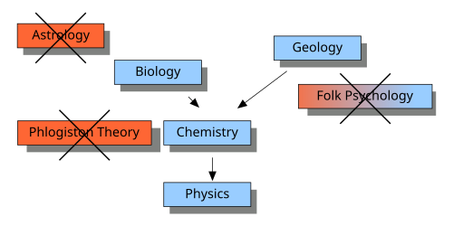

#core/appliedneuroscience #fundamental/logic

Eliminativism, often referred to as eliminative materialism in the philosophy of mind, is the **view that certain common-sense mental states and concepts like beliefs, desires, intentions, and even consciousness do not actually exist.** It challenges the validity of "folk psychology," which is the everyday framework people use to explain human behaviour through mental states like emotions and thoughts.

## Key Ideas of Eliminativism

1. **Rejection of Folk [Psychology](../../../003_education/kings-college/03_mental_health_in_the_community/psychiatry_vs_psychology.md#psychology)**
   - Folk psychology is seen as a flawed and outdated framework.
   - Concepts like belief and desire are not grounded in scientific understanding and will likely be replaced by neuroscientific explanations.

2. **Denial of Mental States**
   - Mental states, as traditionally understood, do not exist.
   - Terms like "pain" or "love" are considered mischaracterisations of neural processes.

3. **Contrast with Reductionism**
   - Reductionism seeks to explain mental states by reducing them to physical processes (e.g., neural activity).
   - Eliminativism claims these states do not exist at all and should be eliminated from scientific theories.

4. **Scientific Basis**
   - Motivated by advancements in neuroscience and cognitive science, which suggest many psychological concepts lack a coherent basis in brain function.

5. **Predictive Nature**
   - Eliminativism predicts that as science progresses, folk psychological concepts will be discarded because they fail to correspond to anything real.

## Examples of Eliminativist Claims

- Outdated concepts like phlogiston (in chemistry) or the luminiferous ether (in physics) were eliminated by science. Similarly, terms like "belief" and "desire" may eventually be discarded.
- Some eliminativists argue against the existence of:
  - **Qualia**: Subjective experiences.
  - **Propositional [Attitudes](../../../003_education/kings-college/02_psychological_foundations/attitudes.md)**: Mental states involving beliefs about something.

## Criticisms

1. **Intuitive Implausibility**
   - It seems absurd to deny the existence of mental states when people experience them directly.

2. **Self-Refutation**
   - Eliminativism may be incoherent because it uses concepts like "belief" to argue that beliefs do not exist.

3. **Empirical Concerns**
   - Critics question whether neuroscience will ever fully eliminate the need for psychological concepts in explaining behaviour.

## Consciousness Science Context

The eliminativist position sits at the heart of contemporary debates in consciousness science. Several major frameworks directly challenge or engage with eliminativist claims:

 **Neural Correlates of Consciousness (NCC)**: The empirical programme to identify minimal neural mechanisms sufficient for conscious experience represents a direct challenge to eliminativism. If specific neural patterns can be reliably linked to conscious states, this provides evidence against the claim that consciousness as a category is fundamentally misguided.

 **Integrated Information Theory (IIT)**: Proposes that consciousness corresponds to integrated information (phi), measured in bits. This framework takes consciousness seriously as a real phenomenon, arguing it is a fundamental property of certain physical systems. Eliminativists must therefore explain away not just folk psychological terms but also mathematically rigorous theories of consciousness.

 **Global Workspace Theory (GWT)**: Models consciousness as information broadcast across brain-wide networks. The theory makes testable predictions about when conscious access occurs, providing empirical grounding that eliminativists must address.

 **Higher-Order Theories**: Frameworks like Higher-Order Thought (HOT) theory posit that consciousness requires meta-cognitive representations of one's own mental states. These directly engage with eliminativist denials of propositional [attitudes](../../../003_education/kings-college/02_psychological_foundations/attitudes.md) and self-awareness.

The "hard problem" of consciousness (Chalmers) remains the central challenge: explaining why and how physical processes give rise to subjective experience. Eliminativists effectively argue the hard problem is illusory, a position that requires dismissing not just folk psychology but the entire phenomenological tradition from Brentano to contemporary neurophenomenology.
