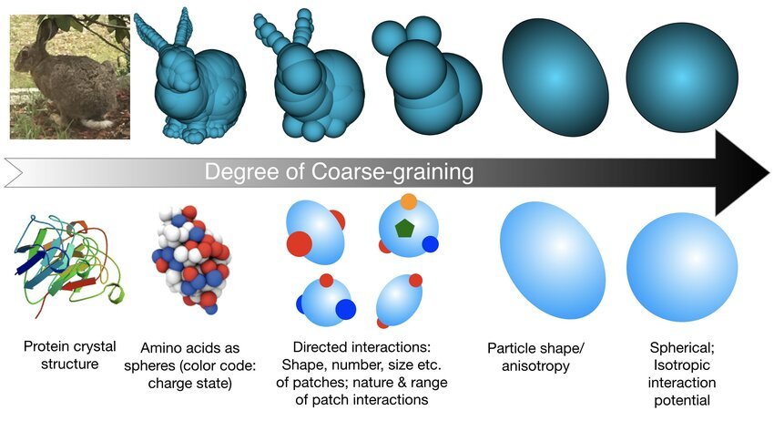

#core/appliedneuroscience 

Coarse graining is a methodological approach in science, particularly neuroscience, that **simplifies complex systems by reducing details—such as through averaged observations or simplified experimental models—to uncover fundamental principles and dynamics.** This counters the challenges of high-dimensional data from advanced recordings, which can lead to biases, over-interpretation, and errors, as seen in cerebral cortex studies where the brain's vast complexity dwarfs that of simpler organs like the heart.

## Key Concepts

- **Purpose and Rationale**: Simplifies preparations to highlight core phenomena, akin to studying genetics in yeast or physiology in isolated organs. In brain research, it enables robust analysis amid low signal-to-noise ratios and astronomical degrees of freedom.
- **Methods**: Includes pharmacological manipulations (e.g., inducing oscillatory states), anaesthetic states for stable dynamics, or focusing on basic rhythms like EEG alpha waves.
- **Benefits**: Reduces errors in analysis algorithms; facilitates extrapolation from simplified systems to complex ones; complements high-tech tools like multi-channel recordings without attempting exhaustive bottom-up simulations (e.g., Blue Brain project's limitations).
- **Applications**: From spatiotemporal patterns to clinical oscillations and behaviour, coarse graining reveals insights like self-organisation in neural activity.

## Examples from Cerebral Cortex Dynamics

The paper illustrates coarse graining through three cases:

- **Emergent Spatial Patterns**: Using organotypic slices treated with bicuculline and carbachol to observe stable spiral waves, later seen in vivo epilepsy models (e.g., Mongolian gerbils). Simplifies to study mesoscopic organisation.
- **Human Brain Oscillations**: Analysing posterior basic rhythm (PBR) development in autistic children via EEG—focusing on simple traits like frequency acceleration for clinically relevant findings.
- **Complex Behavior**: Simplifying discrimination learning in animals (e.g., gerbils) by reducing behavioural dimensions, avoiding covert cues and unitary experience complexities.