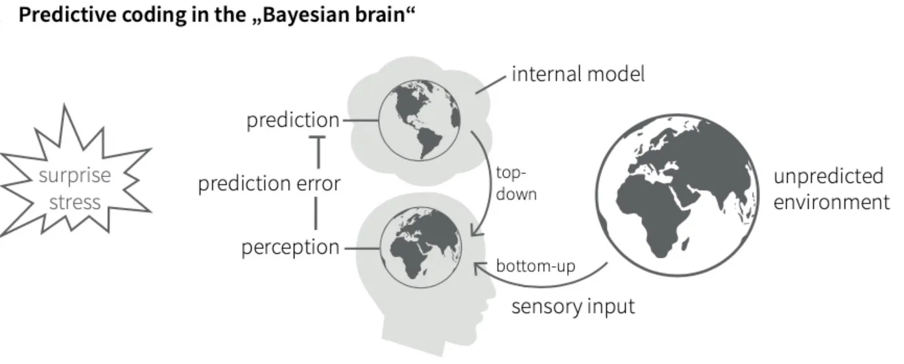

#lead/computationalphilosophy #core/appliedneuroscience #core/artificialintelligence

The Bayesian brain hypothesis proposes that the **brain interprets the world through the framework of Bayesian probability.** According to this hypothesis, the brain continuously updates its beliefs about the world based on incoming sensory information and prior beliefs, effectively performing probabilistic inference. This is a hypothesis, not an established neural mechanism: the figure presents a proposed predictive-coding implementation, not proof that the brain calculates posteriors.

## Key Concepts

### Probabilistic Inference

- **Predictive Coding:** The brain predicts sensory inputs based on prior knowledge and minimises the error between its predictions and actual sensory data.
- **Error Correction:** Prediction errors (the difference between expected and actual signals) are used to update and refine the brain’s models of the world.

### Bayesian Updating

- Bayesian updating revises beliefs in light of new evidence: a **prior** is an existing belief, a **likelihood** is the evidence given the hypothesis, and a **posterior** is the belief revised by that evidence. See [Bayes' theorem](../books/essential_math_for_data_science/bayes_theorem.md) for the formal statement. This terminology describes the hypothesis at a computational level; it does not imply that neurons implement the formula.

Prediction error may also sit within the body–environment control loop proposed by [distributed adaptive control theory](distributed_adaptive_control_theory.md), but that is a related and distinct hypothesis. Neither agreement with sensory data nor a predictive model establishes phenomenal experience; [phenomenology](../../003_education/kcl/03_mental_health_in_the_community/phenomenology.md) and [consciousness engineering](../_general/consciousness_engineering.md) therefore constrain, rather than confirm, what such a model would preserve.
