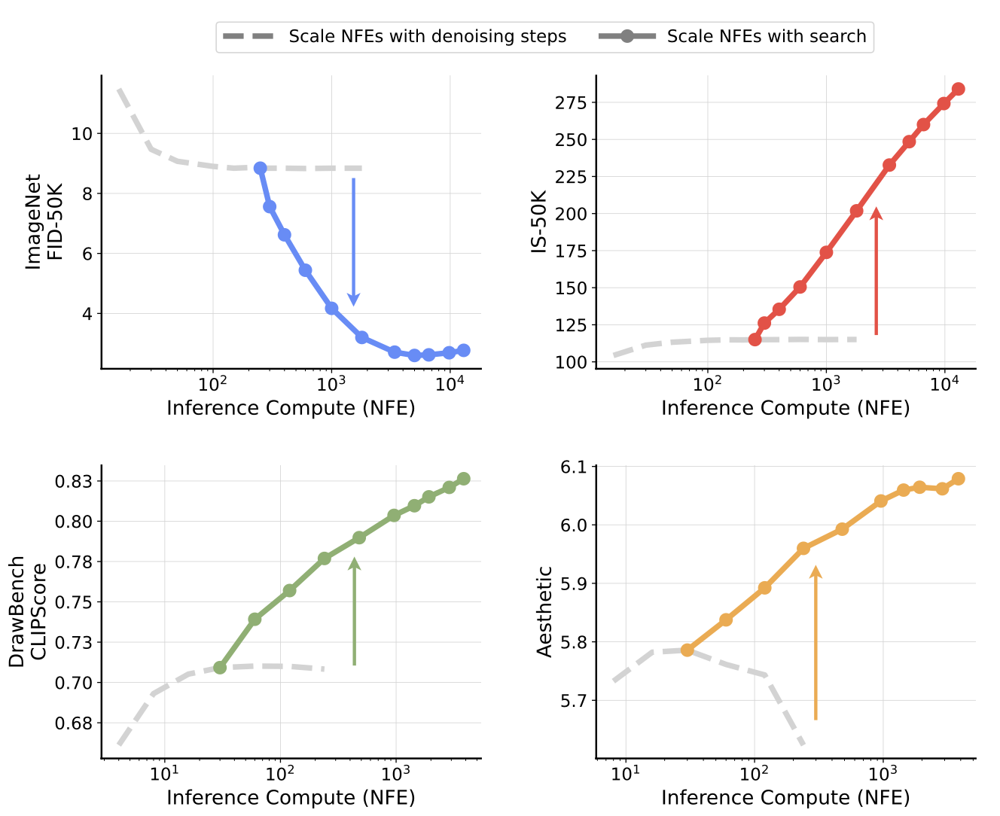

#core/artificialintelligence 

Inference-time scaling in diffusion models refers to **enhancing generative performance during the sampling (inference) phase by allocating additional computational resources, extending beyond the conventional method of simply increasing the number of denoising steps.** This approach frames the problem as a search for optimal initial noises or sampling paths, leveraging verifiers for quality feedback and search algorithms to explore the noise space, leading to improved sample quality in tasks like image generation without retraining the model.

## Key Concepts

- **Role in Generation**: Allocates extra compute at generation time (e.g., via search) to boost quality, contrasting training-time scaling (e.g., more data/parameters); enables "thinking longer" for better outputs.
- **Beyond Denoising Steps**: Traditional scaling increases function evaluations (NFEs) for finer denoising, but this work introduces noise search to find better starting points or paths, yielding larger gains.
- **Search Framework**: Structured on two axes:
  - **Verifiers**: Score functions $V$ evaluating samples (e.g., FID/IS for oracles, CLIP/DINO for supervised, self-supervised similarity).
  - **Algorithms**: Methods to generate/refine noise candidates, e.g., random search (select best from N candidates), zero-order search (iterative refinement in noise neighbourhoods), or path search (branching intermediate noises).

## Methods and Examples

- **Framework Instantiation**: Applied to models like SiT-XL (class-conditioned ImageNet) and FLUX.1-dev (text-to-image); fix denoising steps (e.g., 250 NFEs), scale search compute.
- **Verifiers Types**:
  - Oracle: Use privileged metrics like FID/IS.
  - Supervised: Condition-aware like CLIPScore.
  - Self-Supervised: Feature similarity without extras.
- **Algorithms**:
  - Random Search: Generate N noises, denoise, pick best per verifier.
  - Zero-Order: Refine via locality-constrained perturbations.
  - Path Search: Explore branching trajectories mid-sampling.
- **Experiments**:
  - ImageNet: Random search with oracles improves FID/IS; supervised verifiers boost metrics but risk "hacking" (e.g., reduced diversity).
  - Text-to-Image (DrawBench, T2I-CompBench): Verifier ensembles (e.g., Aesthetic + CLIP + ImageReward) yield up to 64% relative gains; compatible with finetuned models like DPO-SDXL.
  - Efficiency: Smaller models with search outperform larger ones (e.g., PixArt-Σ beats FLUX at lower compute).

## Implications

- Customisable for tasks: Balance verifiers/algorithms to avoid biases (e.g., aesthetic over-alignment).
- Compute Trade-offs: Enables high-quality generation with modest models, accelerating prototyping.

> [!note] Insight on Generative AI
> This paradigm shift suggests inference-time search could rival training scaling laws, potentially democratising advanced diffusion models by leveraging compute dynamically for diverse applications like creative tools or scientific simulations.