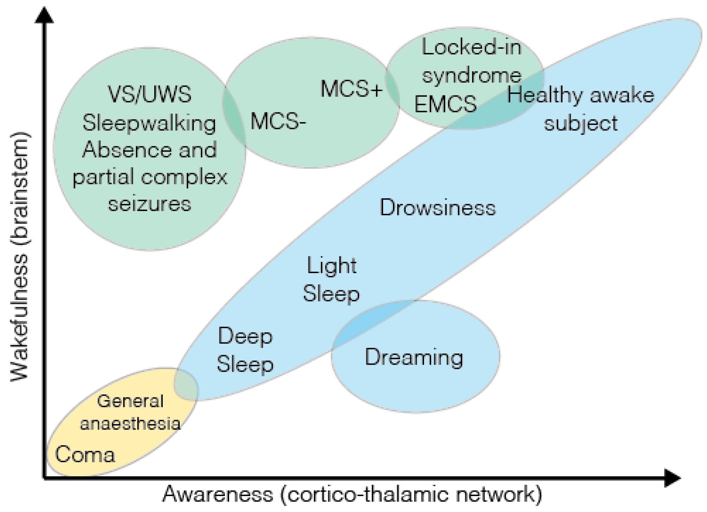

#lead/experimentalmedicine #core/appliedneuroscience

In this vault, **Quantitative Consciousness Index (QCI) is an informal umbrella term**, not the name of one universal, validated instrument. It groups quantitative neural and behavioural measures that may help characterise arousal, responsiveness, or consciousness-related states. These measures use technology and data analysis, but they do not all target the same construct, and none should automatically be treated as a direct measurement of phenomenal consciousness.

## Methods and Technologies

Several techniques may fall under this informal umbrella:

- **Electroencephalography (EEG) and quantitative EEG (qEEG):** Signal-derived features that can support assessment of clinical state or disorders of consciousness; they are context-dependent neural measures rather than direct phenomenal-consciousness readouts.
- **Processed EEG indices (BIS and PSI):** Estimates of anaesthetic depth and, in defined clinical settings, probabilities related to explicit recall or responsiveness. NICE describes related depth-of-anaesthesia monitors as having limitations; these indices are not direct measures of phenomenal consciousness.
- **Auditory-evoked indices:** Measures of stimulus-evoked neural responses. They are not universal consciousness meters.
- **Perturbational Complexity Index (PCI):** A specific TMS–EEG perturbational complexity measure. Casali et al. reported state-discrimination evidence, but PCI is not a proof of phenomenal consciousness, personal identity, or continuity; it also does not directly measure IIT's Φ.

## Comparison and limitations

| Approach | What it measures or estimates | What it does not establish |
| :------- | :---------------------------- | :------------------------- |
| **QCI** | An informal umbrella for several quantitative approaches | A single universal instrument or a settled consciousness scale |
| **PCI** | TMS-evoked, high-density EEG complexity; evidence for discriminating studied conscious and unconscious states | A proof of phenomenal consciousness, personal identity, continuity, or Φ |
| **BIS/PSI** | Processed EEG estimates used for anaesthetic depth and probability of responsiveness in defined clinical settings | Direct phenomenal consciousness |
| **Auditory-evoked indices** | Neural responses evoked by an auditory stimulus | A universal consciousness meter |
| **[IIT Φ](../videos/integrated_information_theory.md)** | A theoretical causal/intrinsic quantity over a specified causal system, within IIT's formalism | PCI or a standard EEG-derived measurement; a real-time measurement of Φ unless the causal formalism is actually instantiated |
| **[Glasgow Coma Scale (GCS)](../../003_education/buckingham/nice_head_injury_guide.md#glasgow-coma-scale-gcs)** | Observed eye-opening, verbal, and motor responses | A complete measure of phenomenal experience |

## Applications

- **Anaesthesia:** Supporting monitoring of anaesthetic depth in defined clinical settings; processed EEG should not be equated with phenomenal consciousness.
- **Disorders of Consciousness:** Assessing and tracking state-related neural or behavioural features in patients with conditions like coma, vegetative state, and minimally conscious state.
- **Prognosis:** Informing estimates of recovery in patients with brain injuries or disorders of consciousness, without guaranteeing a particular outcome.

## Limitations

- "Quantitative Consciousness Index" is an informal umbrella here, not a single validated instrument.
- The component measures estimate different targets, including responsiveness, anaesthetic depth, evoked responses, and perturbational complexity.
- A neural proxy can provide state-discrimination evidence without proving phenomenal consciousness or personal identity and continuity.
- Interpretation of EEG data and other quantitative measures requires specialised expertise and clinical context.

## Sources

- [Casali et al. (2013), Perturbational Complexity Index](https://doi.org/10.1126/scitranslmed.3006294)
- [NICE HTG292](https://www.nice.org.uk/guidance/htg292) — limitations and intended use of processed EEG depth-of-anaesthesia monitors.
- [IIT 4.0](https://doi.org/10.1371/journal.pcbi.1011465) — theoretical formalism for Φ, distinct from PCI and standard EEG-derived measures.
