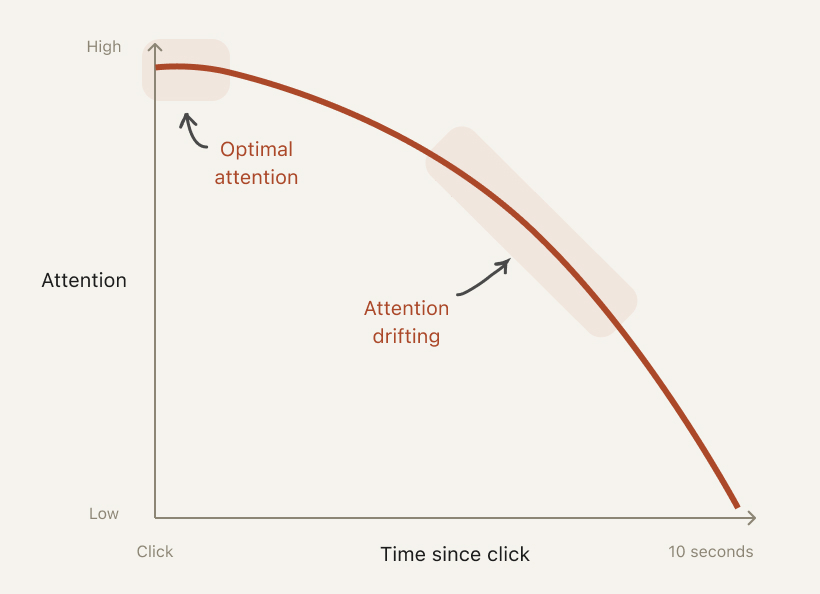

#core/appliedneuroscience 

Cognitive drift refers to **unintended shifts in attention, thought processes, or behaviours that lead individuals away from their original intentions, goals, or focus.** This phenomenon appears across various fields like psychology, user experience design, personal development, and therapy, often resulting from distractions, misaligned incentives, or gradual cognitive changes. While it can foster creativity through mind wandering, it frequently hinders productivity, decision-making, and task performance.

## Key Concepts

- **Attention and Mind Wandering**: A form of "decoupled attention" where focus shifts inward to self-generated thoughts, akin to daydreaming. This can occur during tasks requiring concentration, reducing comprehension.
- **Goal and Incentive Misalignment**: Gradual deviation from core values or objectives toward pursuing rewards or incentives, leading to ethical or behavioural compromises.
- **Supervisory or Process Drift**: In professional contexts like therapy or projects, omission or deprioritisation of essential components, often due to emotional, cognitive, or experiential factors.
- **UX and Interaction Delays**: Loss of user focus when technology responses exceed one second, causing disengagement in digital interfaces.

## Benefits and Perils

From studies on mind wandering (a related aspect):

- **Benefits**:
  - **Prospection**: Aids in planning future scenarios, e.g., anticipating outcomes like seeking help after a poor grade.
  - **Creativity**: Enhances innovative thinking, as shown in experiments where participants generated more novel ideas after periods of mind wandering.

- **Perils**:
  - Reduced task performance, such as lower reading comprehension during complex texts.
  - Ethical slips, like diverting clients for personal gain in business.
  - In therapy supervision, avoiding key components, impacting training quality.