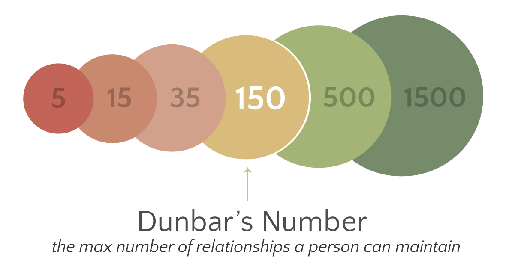

#core/appliedneuroscience

Dunbar’s Number is a **theoretical limit to the number of people with whom one can maintain stable social relationships.** It was first proposed by British anthropologist [Robin Dunbar](https://en.wikipedia.org/wiki/Robin_Dunbar).

## Key Concepts

### Stable [Social](../../../003_education/kings%20college/02%20Psychological%20Foundations/Social%20cognition.md) Relationships

- These are relationships in which an individual knows who each person is and how each person relates to every other person in the network.
- Dunbar’s number is based on cognitive limits, not the time constraints of socialising.

### Dunbar’s Layers

- Dunbar proposed that the total group breaks down into smaller, more intimate circles.
- The closest layer consists of about 5 people (friends/family), the next one of 15 (good friends), the next one of 50 (friends), and the next of 150 (meaningful contacts), with further layers containing 500 and 1500 contacts that can be described as acquaintances and people you can recognise by sight respectively.

## Criticism and Interpretation

- The number is not universally agreed upon and varies depending on the individual and their social skills.
- It’s also important to note that modern communication technology and social networks may impact these numbers.

## Applications

- Used in areas like business organisation design, online communities, and network analysis to understand and predict human social behaviour.
