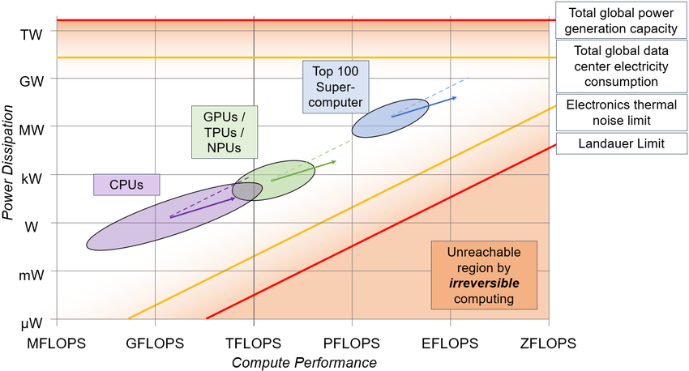

#core/mathematicalphysics 

The Landauer limit, stemming from [Rolf Landauer](https://en.wikipedia.org/wiki/Rolf_Landauer)'s principle proposed in 1961, defines the **theoretical minimum energy required to irreversibly erase one bit of information during computation, grounded in the thermodynamics of information processing.** This bound, calculated as $k T \ln 2$ where $k$ is Boltzmann's constant and $T$ is temperature, underscores that computation isn't free energetically, with erasure dissipating heat, and has profound implications for efficient computing designs.

## Key Concepts

- **Core Principle**: Applies to logically irreversible operations, like bit erasure, where information loss increases entropy, requiring energy dissipation as heat. Reversible computations can theoretically avoid this cost.
- **Equation and Value**:
  - Energy per bit: $E = k_B T \ln 2$, with $k_B \approx 1.38 \times 10^{-23}$ J/K.
  - At room temperature (300 K): Approximately $2.8 \times 10^{-21}$ J (or about 0.017 eV) per bit.
- **Reversible Computing**: By using reversible logic gates (e.g., Fredkin or Toffoli gates), computations can approach zero energy dissipation, though practical implementations face challenges.

## Implications and Applications

- **Computing Efficiency**: Modern silicon chips operate far above the limit (e.g., ~10^4 times higher per operation), but parallel and quantum systems could get closer, impacting energy costs for large-scale AI and data centres.
- **Quantum and Photonic Computing**: Subject to the limit, but photonic systems might reduce it by using lower-energy photons; quantum bits (qubits) add nuances due to decoherence.
- **Biological Systems**: The human brain, while efficient, is estimated to be 10^6 to 10^8 times above the limit per synaptic event, suggesting room for more efficient neuromorphic hardware.
- **Finite-Time Computing**: In parallel setups, energy per operation can stay near the limit even for complex problems, but speed trades off with energy.
