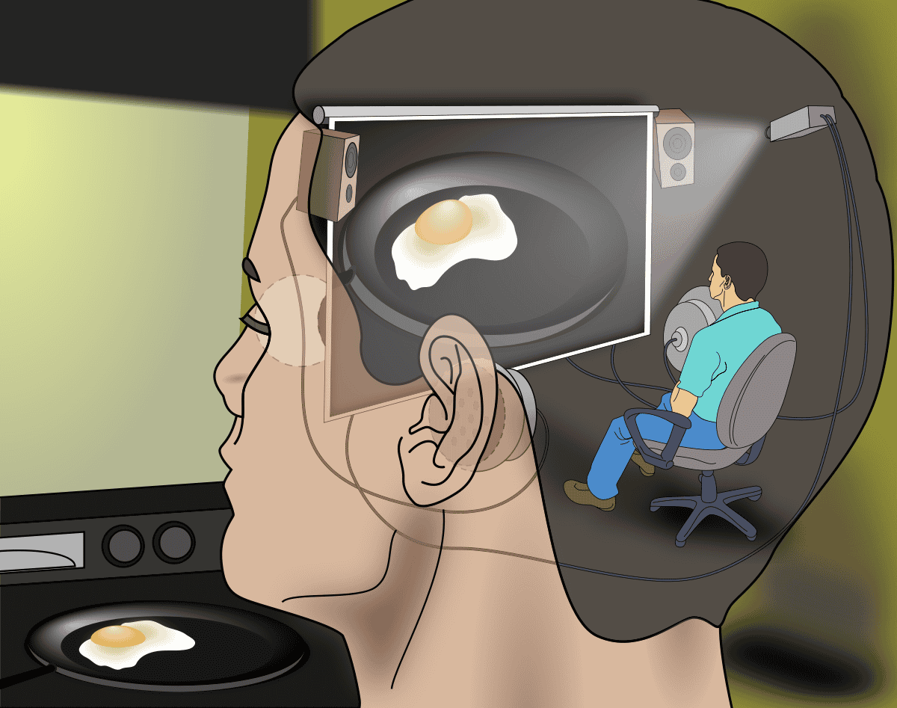

#core/appliedneuroscience #core/artificialintelligence

- The term “Cartesian Theatre” was introduced by [Daniel Dennett](https://en.wikipedia.org/wiki/Daniel_Dennett) in his book “Consciousness Explained” (1991). It critiques a dualistic view of the mind that Dennett attributes to René Descartes, though Descartes himself did not use the term. **The metaphor suggests a place in the mind where “everything comes together”** for the benefit of a central observer or “homunculus.”

## Concept

- The Cartesian Theatre posits a theoretical stage in the mind where sensory inputs are presented to a conscious self or soul.
- It embodies the idea of a central point in the brain where all experiences are processed and observed.
- This concept is used to argue against the dualistic approach that separates mind and body, suggesting a non-physical entity observes physical processes.

## Criticisms by Dennett

- **Homunculus Fallacy**: The idea inevitably leads to a regress problem, where if a little observer (homunculus) is watching the theatre, who is watching the observer? This would require an infinite series of internal viewers.
- **Misrepresents Consciousness**: Dennett argues that consciousness does not occur at a single central point. Instead, it emerges from parallel processes and interactions within the brain’s neural networks.
- **Reductionism**: The Cartesian Theatre simplifies the complex nature of consciousness to a single, unified experience, ignoring the distributed and decentralised aspects of brain activity.

> [!warning] Implications for neuroscience
> - **Distributed [Processing](../../books/How%20To%20Build%20a%20Brain/Deep%20and%20shallow%20semantic%20processing.md)**: Modern neuroscience supports the view that brain functions are distributed across various regions, with no central area where “everything comes together.”
> - **Consciousness as an [Emergent](../../videos/Emergent%20properties.md) Property**: Consciousness is increasingly viewed as an emergent property of complex brain processes, not as a single stream observed by an internal entity.
> - **Rejecting Dualism**: The critique of the Cartesian Theatre supports a more integrated view of mind and body, aligning with physicalist and materialist perspectives in neuroscience.
